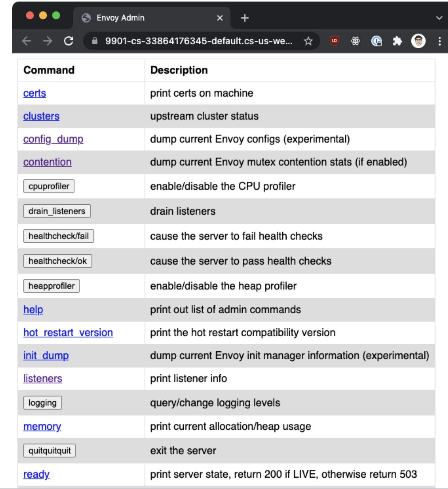
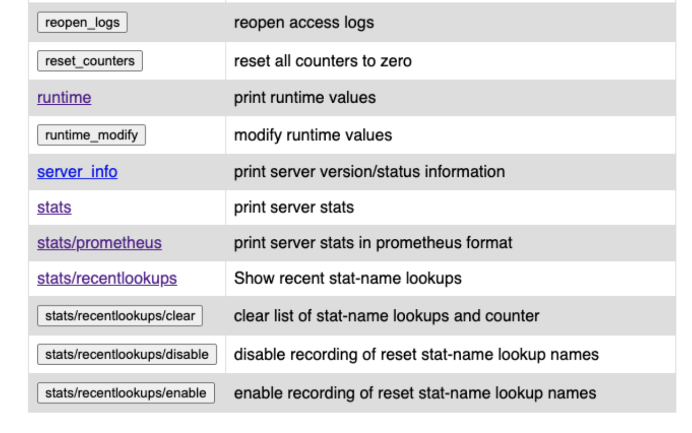

# Admin Interface

Throughout the course, we’ve referred to the administration interface a couple of times. Envoy exposes an admin interface that allows us to modify Envoy and get a view and query for the metrics and configuration.

The admin interface consists of a REST API with multiple endpoints and a simple UI, as shown in the figure below.

 </img>
 </img>

The admin interface must be explicitly enabled using the admin field. For example:

```yaml
admin:
  address:
    socket_address:
      address: 127.0.0.1
      port_value: 9901
```

Be careful when enabling the administrative interface. Anyone with access to the admin interface can perform destructive operations, such as shutting down the server (the /quitquitquit endpoint). We’re also potentially giving them access to private information (metrics, cluster names, certificate information, and so on). Currently (Envoy version 1.20), the admin endpoint is unsecured, and there’s no way to configure authentication or TLS. There’s a work item in progress that will restrict access only to trusted IPs and client certificates to ensure transport security.

Until that work is completed, access to the admin interface should be allowed only via a secure network and only from hosts attached to that secure network. We have an option of allowing access to the admin interface via localhost only, as shown in the above configuration. Alternatively, if you decide to allow access from remote hosts, then make sure you also set up firewall rules.

In the upcoming lessons, we’ll look at the different features of the admin interface in more detail.