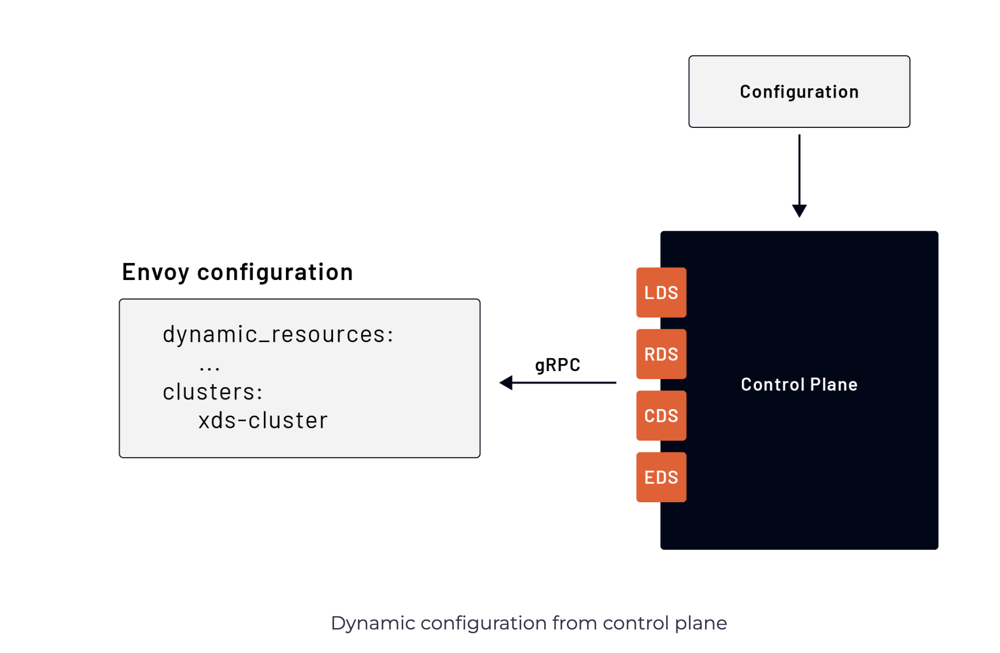

# Dynamic Configuration: Control Plane
Using the control plane to update Envoy is more complex than using configuration from the file system. We have to create our control plane that implements the discovery service interfaces. A simple example of an xDS server implementation is available [here](https://github.com/envoyproxy/go-control-plane/tree/main/internal/example). The example shows how to implement different discovery services and run an instance of the gRPC server Envoy connects to retrieve the configuration.

The dynamic configuration on the Envoy side is similar to the one used for the file system. This time, the difference is that we provide the location of the gRPC server that implements the discovery services. We do that by specifying a cluster through static resources:

</img>

```yaml
...
dynamic_resources:
  lds_config:
    resource_api_version: V3
    api_config_source:
      api_type: GRPC
      transport_api_version: V3
      grpc_services:
        - envoy_grpc:
            cluster_name: xds_cluster
  cds_config:
    resource_api_version: V3
    api_config_source:
      api_type: GRPC
      transport_api_version: V3
      grpc_services:
        - envoy_grpc:
            cluster_name: xds_cluster

static_resources:
  clusters:
  - name: xds_cluster
    type: STATIC
    load_assignment:
      cluster_name: xds_cluster
      endpoints:
      - lb_endpoints:
        - endpoint:
            address:
              socket_address:
                address: 127.0.0.1
                port_value: 9090
```

The control plane doesn’t need to operate on Envoy concepts. It may abstract configurations. It can also collect input from users using graphical UI or different YAML, XML, or any other configuration files. The important portion is that regardless of how the high-level configuration comes into the control plane, it needs to be translated into Envoy xDS API.

For example, Istio is a control plane for a fleet of Envoy proxies that can be configured through various custom resource definitions (VirtualService, Gateway, DestinationRule, …). In addition to the high-level configuration, in [Istio](https://istio.io/), the Kubernetes environment and services running inside the cluster are also used as an input to generate the Envoy configuration. Together, the high-level configuration and the discovered services in the environment can be used as input to your control plane. The control plane can take those inputs, transform them into Envoy-readable configuration and send them over gRPC to Envoy instances.

