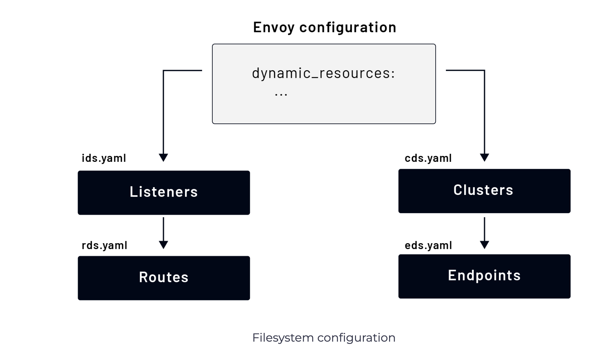

# Dynamic Configuration: Filesystem
One way of dynamically providing configuration is by pointing to files on a file system. For dynamic configuration to work, we need to provide the information under the node field. The node field is used to identify a specific Envoy instance if we might have multiple Envoy proxies pointing to the same configuration files.

</img>

To point to the dynamic resource, we can use the dynamic_resources field to tell Envoy where to find dynamic configuration for specific resources. For example:

```yaml
node:
  cluster: my-cluster
  id: some-id

dynamic_resources:
  lds_config:
    path: /etc/envoy/lds.yaml
  cds_config:
    path: /etc/envoy/cds.yaml
```

The above snippet is a valid Envoy configuration. The individual configurations for LDS and CDS would be very similar if we’d provide them as static resources. The one difference is that we have to specify the resource type and version information. Here’s a snippet of the CDS configuration:

```yaml
version_info: "0"
resources:
- "@type": type.googleapis.com/envoy.config.cluster.v3.Cluster
  name: instance_1
  connect_timeout: 5s
  load_assignment:
    cluster_name: instance_1
    endpoints:
    - lb_endpoints:
      - endpoint:
          address:
            socket_address:
              address: 127.0.0.1
              port_value: 3030
```

If we wanted to use EDS to provide endpoints for the cluster, we could write the above configuration like this:

```yaml
version_info: "0"
resources:
- "@type": type.googleapis.com/envoy.config.cluster.v3.Cluster
  name: instance_1
  type: EDS
  eds_cluster_config:
    eds_config:
      path: /etc/envoy/eds.yaml
```

Also, notice we’ve set the type of the cluster to EDS. The EDS configuration would look like this:

```yaml
version_info: "0"
resources:
- "@type": type.googleapis.com/envoy.config.endpoint.v3.ClusterLoadAssignment
  cluster_name: instance_1
  endpoints:
  - lb_endpoints:
    - endpoint:
        address:
          socket_address:
            address: 127.0.0.1
            port_value: 3030
```

As any of the files get updated, Envoy will automatically reload the configuration. Envoy will output the error if the configuration is invalid but will keep the existing (working) configuration running.