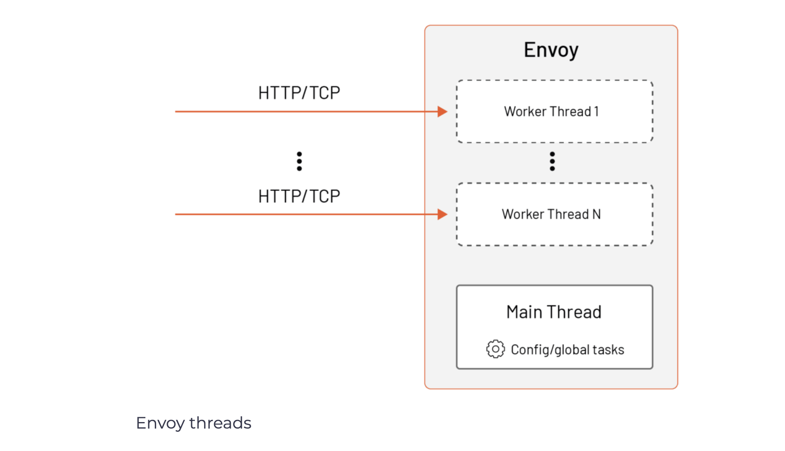
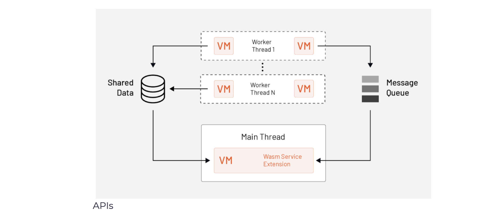
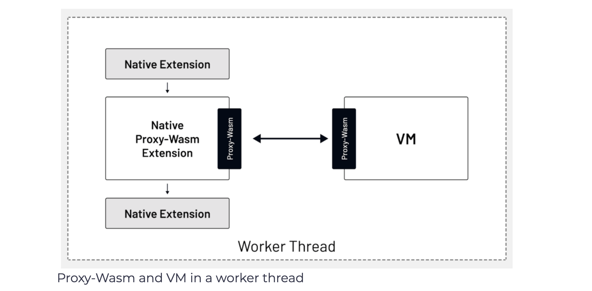
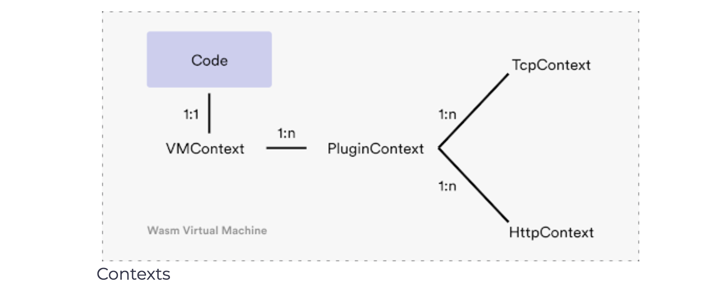

## WebAssembly (Wasm)
Wasm is a portable binary format for executable code that relies on an open standard. It allows developers to write in their preferred programming language and then compile the code into a **Wasm module**.

</img>

The Wasm modules are isolated from the host environment and executed in a memory-safe sandbox called a **virtual machine (VM)**. Wasm modules use an API to communicate with the host environment.

The main goal of Wasm was to enable high-performance applications on web pages. For example, let’s say we’re building a web application with Javascript. We could write some in Go (or other languages) and compile it into a binary file, the Wasm module. Then, we could run the compiled Wasm module in the same sandbox as the Javascript web application.

Initially, Wasm was designed to run in the web browser. However, we can embed virtual machines into other host applications and execute them. This is what Envoy does!

Envoy embeds a subset of a V8 VM. V8 is a high-performance JavaScript and WebAssembly engine written in C++, and it’s used in Chrome and in Node.js, among others.

We mentioned earlier in this course that Envoy operates using a multithreaded model. That means there’s one main thread that’s responsible for handling configuration updates and executing global tasks.

In addition to the main thread, there are also worker threads responsible for proxying individual HTTP requests and TCP connections. The worker threads are designed to be independent of each other. For example, a worker thread processing one HTTP request will not be impacted by other worker threads processing other requests.

</img>

Each thread owns its replica of resources, including the Wasm VMs. The reason for that is to avoid any expensive cross-thread synchronization in terms of higher memory usage.

Envoy loads every unique Wasm module (all *.wasm files) into a unique Wasm VM at run time. Since Wasm VM is not thread-safe (i.e., multiple threads would have to synchronize access to a single Wasm VM), Envoy creates a separate replica of Wasm VM for every thread on which the extension will be executed. Consequently, every thread might have multiple Wasm VMs in use at the same time.

## Proxy-Wasm
The SDK we’ll use allows us to write Wasm extensions that are either HTTP filters, Network Filters, or a dedicated extension type called Wasm Service. These extensions are executed inside a Wasm VM on a worker thread (HTTP filters, Network filters) or on the main thread (Wasm Service). As we mentioned, the threads are independent, and they are inherently unaware of request processing happening on other threads.

The HTTP filter is the one that handles the HTTP protocol, and it operates on HTTP headers, body, and so on. Similarly, the network filter handles TCP protocols and operates on data frames and connections. We can also say that these two plugin types are stateless.

Envoy also supports stateful scenarios. For example, you could write an extension that aggregates stats such as request data, logs, or metrics across multiple requests — this essentially means across numerous worker threads. For this scenario, we’d use the Wasm Service type. The Wasm service type runs on a singleton VM; there’s only one instance of this VM, and it runs on the Envoy main thread. You can use it to aggregate metrics or logs from the stateless filters.

The figure below shows how the Wasm service extension is executed on the main thread, instead of HTTP or network filters, which are executed on worker threads.

</img>

The fact that the Wasm service extension is executed on the main thread doesn’t impact the request latency. On the other hand, the network or HTTP filters can impact the latency.

The figure shows a Wasm Service extension running on the main thread that uses the Message Queue API to subscribe to a queue and receive messages sent by the HTTP filter or Network Filter running on the worker threads. The Wasm Service extension can then aggregate data received from the worker threads.

Wasm Service Extensions aren’t the only way to persist data. You can also call out to HTTP or gRPC APIs. Moreover, we can perform actions outside requests using the timer API.

The APIs we mentioned, the message queue, timer, and shared data are all defined by a component called [Proxy-Wasm](https://github.com/proxy-wasm).

Proxy-Wasm is a proxy-agnostic ABI (Application Binary Interface) standard that specifies how proxies (our hosts) and the Wasm modules interact. These interactions are implemented in the form of functions and callbacks.

The APIs in Proxy-Wasm are proxy agnostic, which means that they work with Envoy proxies as well as any other proxies ([MOSN](https://github.com/mosn/mosn), for example) that implement the Proxy-Wasm standard. This makes your Wasm filters portable between different proxies, and they aren’t tied to Envoy only.

</img>

As the requests come into Envoy, they go through different filter chains, get processed by a filter, and at some point in the chain, the request data flows through the native Proxy-Wasm extension.

This extension uses the Proxy-Wasm interface to talk to the extension running inside the VM. Once the filter processes the data, the chain continues, or stops, depending on the result returned from the extension.

Based on the Proxy-Wasm spec, we can use a couple of language-specific SDK implementations to write the extensions in.

In one of the labs, we’ll use [Go SDK for Proxy-Wasm](https://github.com/tetratelabs/proxy-wasm-go-sdk) to write Proxy-Wasm plugins in Go.

[TinyGo](https://tinygo.org/) is a compiler used for embedded systems and WebAssembly. It doesn’t support the use of all standard Go packages. For example, some standard packages such as net and others are not supported.

You also have the option of using Assembly Script, C++, Rust, or Zig.

## Configuring Wasm extensions

The generic Wasm extension configuration in Envoy looks like this:

```yaml
- name: envoy.filters.http.wasm
  typed_config:
    "@type": type.googleapis.com/udpa.type.v1.TypedStruct
    type_url: type.googleapis.com/envoy.extensions.filters.http.wasm.v3.Wasm
    value:
      config:
        vm_config:
          vm_id: "my_vm"
          runtime: "envoy.wasm.runtime.v8"
          configuration:
            "@type": type.googleapis.com/google.protobuf.StringValue
            value: '{"plugin-config": "some-value"}'
          code:
            local:
              filename: "my-plugin.wasm"
        configuration:
          "@type": type.googleapis.com/google.protobuf.StringValue
          value: '{"vm-wide-config": "some-value"}'
```

The vm_config field is used to specify the Wasm VM, runtime, and the actual pointer to the .wasm extension we want to execute.

The vm_id field is used when communicating between VMs. This ID can then be used to share data between VMs through shared data APIs and queues. Note that to reuse the VMs across multiple plugins, you have to use the same vm_id, runtime, configuration, and code.

The next item is the runtime. This is usually set to envoy.wasm.runtime.v8. For example, if we compile the Wasm extension with the Envoy, we’d use the null runtime here. The other options are Wasm micro runtime, Wasm VM, or Wasmtime; - none of these are enabled in the official Envoy builds, however.

The configuration under the vm_config field is used to configure the VM itself. In addition to the VM ID and runtime, the other important piece is the code field.

The code field is where we reference the compiled Wasm extension. This can be either a pointer to a local file (e.g., /etc/envoy/my-plugin.wasm) or a remote location (e.g., https://wasm.example.com/my-plugin.wasm).

The configuration files, one under the vm_config and the other at the config level, are used to provide configuration for the VM and the plugin. These values can then be read from the Wasm extension code when the VM or plugin starts.

To run a Wasm service plugin, we have to define the configuration in the bootstrap_extensions field and set the singleton Boolean field value to true.

```yaml
bootstrap_extensions:
- name: envoy.bootstrap.wasm
  typed_config:
    "@type": type.googleapis.com/envoy.extensions.wasm.v3.WasmService
    singleton: true
    config:
      vm_config: { ... }
```

## Developing Wasm extensions – Proxy-Wasm Go SDK API
When developing Wasm extensions, we’ll learn about the contexts, hostcall API, and entry points.

### Contexts
Contexts are a collection of interfaces in the Proxy-Wasm SDK and are mapped to the concepts we explained earlier.

</img>

For example, there’s a single VMContext in each VM and can have one or more PluginContexts. This means we can run different plugins within the same VM context (i.e., when using the same vm_id). Each PluginContext corresponds to a plugin instance. That’s either a TcpContext (TCP network filter) or HttpContext (HTTP filter).

The VMContext interfaces has two functions defined: the OnVMStart function and the NewPluginContext function:

```go
type VMContext interface {
  OnVMStart(vmConfigurationSize int) OnVMStartStatus
  NewPluginContext(contextID uint32) PluginContext
}
```

As the names suggest, the OnVMStart is called after the VM is created. Within this function, we can retrieve the optional VM configuration using the GetVMConfiguration hostcall. The purpose of this function is to perform any VM-wide initialization.

As developers, we need to implement the NewPluginContext function where we create an instance of the PluginContext.

The PluginContext interface defines functionally similar functions as the VMContext. Here’s the interface:

```go
type PluginContext interface {
  OnPluginStart(pluginConfigurationSize int) OnPluginStartStatus
  OnPluginDone() bool

  OnQueueReady(queueID uint32)
  OnTick()

  NewTcpContext(contextID uint32) TcpContext
  NewHttpContext(contextID uint32) HttpContext
}
```


The OnPluginStart function is comparable to the OnVMStart function we mentioned earlier. It gets called when the plugin gets created. Within this function, we also can retrieve the plugin-specific configuration using the GetPluginConfiguration API. We also have to implement either the NewTcpContext or NewHttpContext that gets called in response to HTTP/TCP streams in the proxy. This context also contains some other functions used for setting up the queue (OnQueueReady) or doing asynchronous tasks in parallel to the stream processing (OnTick).

> Refer to the context.go file in the [Proxy Wasm Go SDK Github repository](https://github.com/tetratelabs/proxy-wasm-go-sdk/blob/main/proxywasm/types/context.go) for the latest interface definitions.

### Hostcall API
The hostcall API, implemented here, gives us ways to interact with the Envoy proxy from the Wasm plugin.

The hostcall API defines methods for reading the configuration; setting up a shared queue and performing queue operations; dispatching HTTP calls, retrieving headers, trailers, and body from both request and response streams and manipulating these values; configuring metrics; and more.

### Entry point
The entry point for the plugins is the main function. Envoy creates the VMs, and before it tries to create the VMContext, it calls the main function. In the typical implementation, we call the SetVMContext method the main function:

```go
func main() {
  proxywasm.SetVMContext(&myVMContext{})
}

type myVMContext struct { .... }

var _ types.VMContext = &myVMContext{}

```

