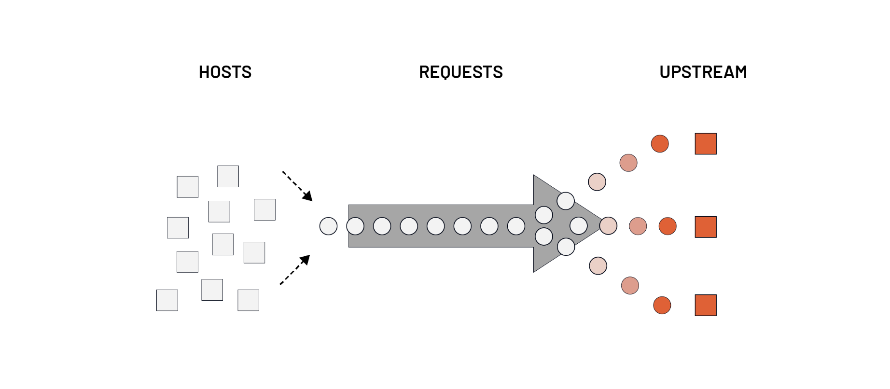
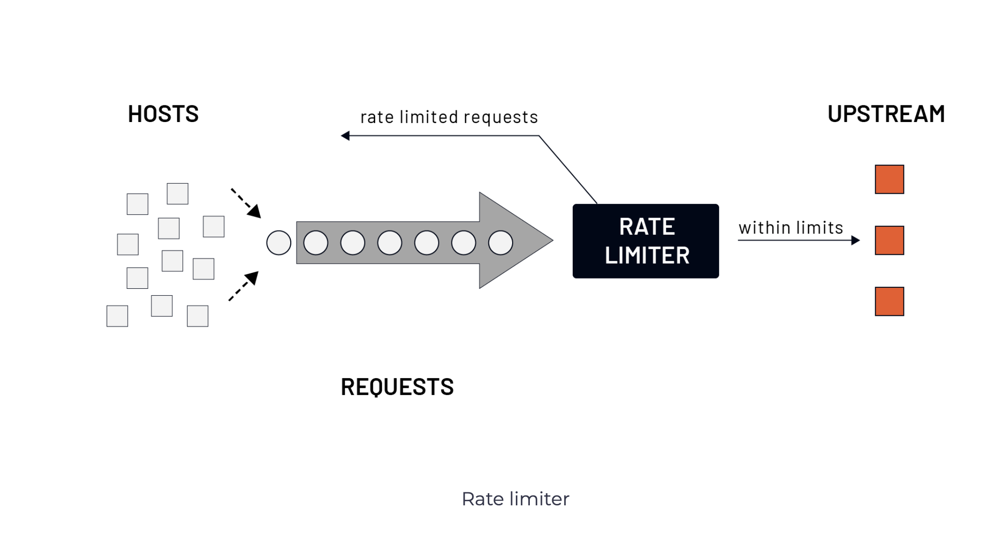
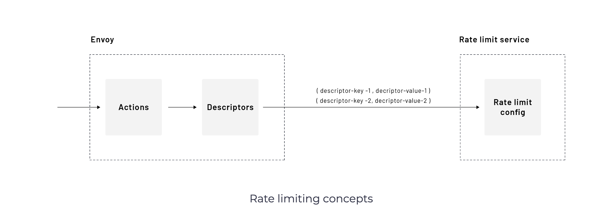
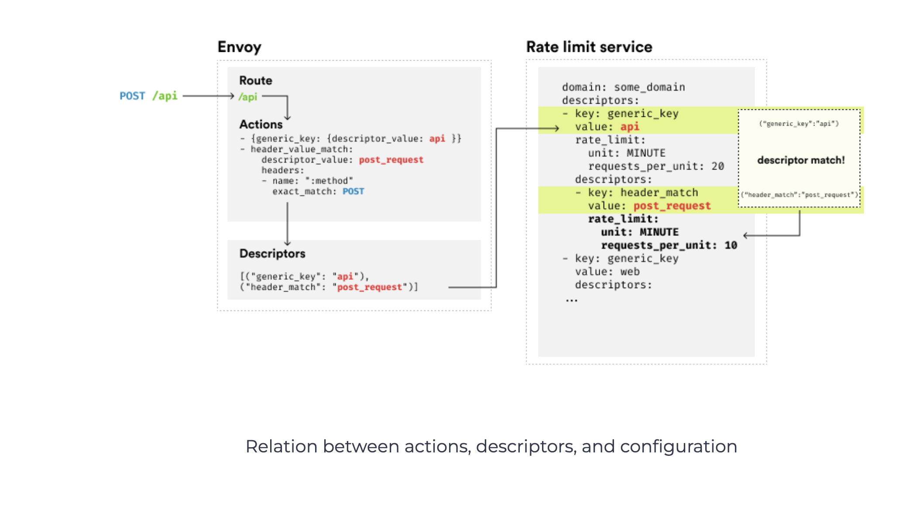

# Global Rate Limiting
Global or distributed rate limiting is useful when many hosts send requests to a small number of upstream servers, and the average latency is low.

 </img>

The requests become backed up because hosts can’t process them quickly enough. In this case, the numerous downstream hosts can overwhelm the small number of upstream hosts. The global rate limiter helps to prevent cascading failures.

 </img>

Envoy integrates with any external rate-limiting services that implement the defined RPC/IDL protocol. The reference implementation of the service uses Go, gRPC, and Redis for its backend and is available here.

The Envoy calls the external rate limit service (that stores the stats and tracks requests in Redis, for example) to get back the answer to whether the request should be rate-limited.

Using an external rate-limiting service, we can apply the limits to a set of services or, if we’re talking about service mesh, to all services in the mesh. We can control the number of requests entering the mesh as a whole.

We can use the local rate limiter to control the requests at an individual service level. The local rate limiter allows each service to have individual rate limits. The local and global rate limiting is typically used together.


 </img>


We define a set of actions in the Envoy configuration on the route or virtual host level. Each action contains a list of rate-limit actions. Let’s consider the following example where rate limits are defined at the virtual host level:

```yaml
rate_limits:
- actions:
  - header_value_match:
      descriptor_value: get_request
      headers:
      - name: :method
        prefix_match: GET
  - header_value_match:
      descriptor_value: path
      headers:
        - name: :path
          prefix_match: /api
- actions:
  - header_value_match:
      descriptor_value: post_request
      headers:
      - name: :method
        prefix_match: POST
- actions:
  - header_value_match:
      descriptor_value: get_request
      headers:
      - name: :method
        prefix_match: GET
```

The above snippet defines three separate actions that contain rate limit actions. Envoy will try to match the request against the rate limit actions and generate descriptors sent to the rate limit service. If Envoy cannot match any single rate limit action to the request, no descriptors get created – i.e., all rate limit actions have to match.

For example, if we receive a GET request to /api, the first action matches both rate limit actions; hence the following descriptor gets created:

("header_match": "get_request"), ("header_match": "path")
The second action isn’t going to match. However, the last one will match as well. Therefore Envoy will send the following descriptors to the rate limit service:

("header_match": "get_request"), ("header_match": "path")
("header_match": "get_request")
Let’s look at another example of the client-side configuration that satisfies the following requirements:

POST requests to /users are rate limited to 10 requests per minute
requests to /users are rate limited to 20 requests per minute
requests with a header dev: true to /api are rate limited to 10 requests per second
requests with a header dev: false to /api are rate limited to 5 requests per second
any other requests to /api are not rate limited
Notice that we’re defining the rate limits at the route level this time.


```yaml
routes:
- match:
    prefix: "/users"
  route:
    cluster: some_cluster
    rate_limits:
    - actions:
      - generic_key:
          descriptor_value: users
      - header_value_match:
          descriptor_value: post_request
          headers:
          - name: ":method"
            exact_match: POST
    - actions:
      - generic_key:
          descriptor_value: users
- match:
    prefix: "/api"
  route:
    cluster: some_cluster
    rate_limits:
    - actions:
      - generic_key:
          descriptor_value: api
      - request_headers:
          header_name: dev
          descriptor_key: dev_request
...
http_filters:
- name: envoy.filters.http.ratelimit
  typed_config:
    "@type": type.googleapis.com/envoy.extensions.filters.http.ratelimit.v3.RateLimit
    domain: some_domain
    enable_x_ratelimit_headers: DRAFT_VERSION_03
    rate_limit_service:
      transport_api_version: V3
      grpc_service:
          envoy_grpc:
            cluster_name: rate-limit-cluster
```
The above configuration contains the rate_limits configuration per route and the envoy.filters.http.ratelimit filter configuration. The filter configuration points to the upstream cluster of the rate limit service. We’ve also set the domain name (domain) and the enabled_x_ratelimit_headers field that specifies we want to use the x-ratelimit headers. The domain name allows us to isolate a set of rate limit configurations per arbitrary domain name.

If we look at the rate limit config in the routes, notice how we split up the actions to match the different rate limits we want to set. For example, we have one action with the api generic key and the request headers. However, within the same configuration, we have an action with only the generic key set. This allows us to configure different rate limits based on these actions.

Let’s translate the actions into descriptors:

```shell
GET /users --> ("generic_key": "users")

POST /users --> ("generic_key": "users"), ("header_match": "post_request")

GET /api 
dev: some_header_value --> ("generic_key": "api"), ("dev_request": "some_header_value")
```

The difference between the header_match and request_headers is that with the latter, we can create rate limits based on the specific header values (for example, dev: true or dev: something as the value of the header becomes part of the descriptor).

On the rate limit service side, we need to develop a configuration that specifies the rate limits based on the descriptors sent by Envoy.

For example, if we send a GET request to /users, Envoy sends the following descriptor to the rate limit service: ("generic_key": "users"). However, if we send a POST request, the descriptor list looks like this:

("generic_key": "users"), ("header_match": "post_request")
The rate limit service configuration is hierarchical to allow for matching nested descriptors. Let’s look at how the rate limit service configuration would look for the above descriptors:

```yaml
domain: some_domain
descriptors:
- key: generic_key
  value: users
  rate_limit:
    unit: MINUTE
    requests_per_unit: 20
  descriptors:
  - key: header_match
    value: post_request
    rate_limit:
      unit: MINUTE
      requests_per_unit: 10
- key: generic_key
  value: api
  descriptors:
  - key: dev_request
    value: true
    rate_limit:
      unit: SECOND
      requests_per_unit: 10
  - key: dev_request
    value: false
    rate_limit:
      unit: SECOND
      requests_per_unit: 5
```

We’ve mentioned the domain value before on the Envoy side configuration. We can now see how to use the domain name. We could use the same descriptor names across the whole fleet of proxies but have them separated by the domain name.

Let’s look at how matching on the rate limit service works for different requests:

| Incoming request | Generated descriptor                                         | Rate limit | Explanation                                                                                           |
|------------------|--------------------------------------------------------------|------------|-------------------------------------------------------------------------------------------------------|
| GET /users       | `("generic_key": "users")`                                   | 20 req/min  | The key `users` matches the first level in the configuration. Since the second level in the config (`header_match`) is not included in the descriptor, the rate limit for the `users` key is used. |
| POST /users      | `("generic_key": "users"), ("header_match": "post_request")` | 10 req/min  | The sent descriptor matches `users` as well as `header_match`, so the rate limit under the `header_match` descriptor is used. |
| GET /api         | `("generic_key": "api")`                                      | No rate limit | We only have a first-level match for `api` descriptor. However, there are no rate limits configured. For the rate limit to be enforced, we need the second descriptors that are only set if the header `dev` is present in the incoming request. |
| GET /api         | `("generic_key": "api"), ("dev_request": "true")`            | 10 req/second | The second descriptor in the list matches the second level in the configuration (i.e., we match `api` and then also `dev_request: true` value). |
| GET /api         | `("generic_key": "api"), ("dev_request": "false")`           | 5 req/second  | The second descriptor in the list matches the second level in the configuration (i.e., we match `api` and then also `dev_request: false` value). |
| GET /api         | `("generic_key": "api"), ("dev_request": "hello")`           | No rate limit | The second descriptor in the list doesn’t match any of the second-level descriptors in the config.   |


In addition to the actions we used in the above example, the table below shows the other actions we can use to create descriptors:

| Action name          | Description                                   |
|----------------------|-----------------------------------------------|
| source_cluster       | Rate limit on the source cluster               |
| destination_cluster  | Rate limit on the destination cluster          |
| request_headers      | Rate limit on request headers                  |
| remote_address       | Rate limit on the remote address               |
| generic_key          | Rate limit on a generic key                    |
| header_value_match   | Rate limit on the existence of request headers |
| metadata             | Rate limit on metadata                         |

The figure below summarizes how the actions relate to the descriptors and the actual rate limit configuration on the rate limit service.

 </img>