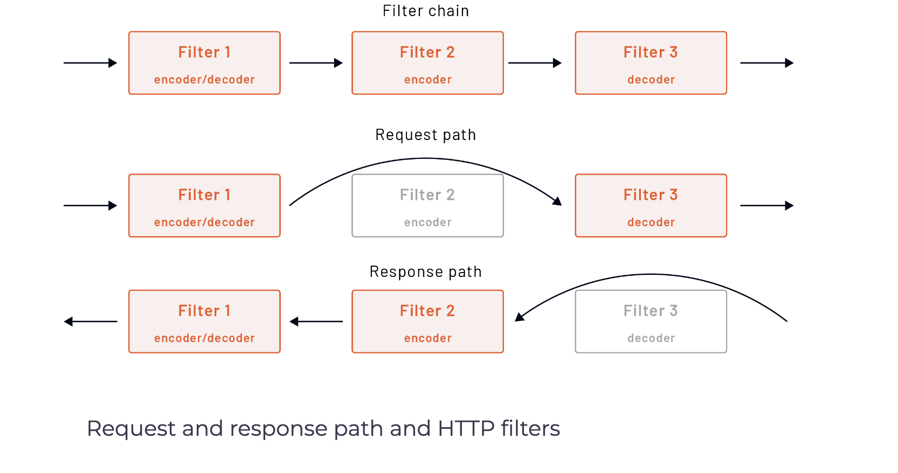

# HTTP connection manager (HCM) introduction

HCM is a network-level filter that translates raw bytes into HTTP-level messages and events (e.g., headers received, body data received, etc.).

The HCM filter also handles standard HTTP functionality. It supports features such as access logging, request ID generation and tracing, header manipulation, route table management, and statistics.

From the protocol perspective, HCM natively supports HTTP/1.1, WebSockets, HTTP/2, and HTTP/3 (still in Alpha).

Envoy proxy was designed to be an HTTP/2 multiplexing proxy, as reflected in the terminology used for describing Envoy’s components.

## HTTP/2 terminology

In HTTP/2, a stream is a bidirectional flow of bytes within an established connection. Each stream can carry one or more messages. A message is a complete sequence of frames that map to an HTTP request or response message. Finally, a frame is the smallest unit of communication in HTTP/2. Each frame contains a frame header which, at a minimum, identifies the stream to which the frame belongs. A frame can carry HTTP headers, message payload information, and so on.

Regardless of which connection a stream originates from (HTTP/1.1, HTTP/2, or HTTP/3), Envoy uses a codec API feature to translate different wire protocols into a protocol-agnostic model of streams, requests, responses, and so on. The protocol-agnostic model means that most Envoy code doesn’t need to understand the specifics of each protocol.

## HTTP Filters

Within the HCM, Envoy supports a set of HTTP filters. Unlike the listener-level filters, these filters operate on HTTP-level messages without knowing the underlying protocol (HTTP/1.1, HTTP/2, etc.) or multiplexing capabilities.

There are three types of HTTP filters:

* Decoder: invoked when HCM is decoding parts of the request stream
* Encoder: invoked when HCM is encoding parts of the response stream
* Decoder/encoder: invoked on both paths, decoding, and encoding
The figure below explains how Envoy invokes different filter types on request and response paths.

</img>

Request and response path and HTTP filters

Like the network filters, individual HTTP filters can either stop or continue executing subsequent filters and share states among themselves within the context of a single request stream.

### Data Sharing
At a high level, we can break the data sharing between filters into static and dynamic states.

The static state contains any immutable data set when Envoy loads the configuration, and it’s broken into three sections:

1. Metadata

Envoy configuration, such as listeners, routes, or clusters, contains a metadata field that stores key/value pairs. Metadata allows us to store filter-specific configurations. The values can’t change (they are immutable) and get shared across all requests/connections. For example, metadata values get used when using subset selectors in clusters.

2. Typed metadata

Instead of converting metadata to a typed class object for each stream or request, the typed metadata allows filters to register a one-time conversion logic for a specific key. The metadata from xDS gets converted to class objects at configuration load time, and filters can request the typed version at runtime without conversion each time.

3. HTTP per-route filter configuration We can also specify configuration per virtual host or route compared to the global configuration that applies to all virtual hosts. Per-route configuration is embedded into the route table and can be specified under the typed_per_filter_config field.

The other way to share data is using a dynamic state. Dynamic state gets generated per connection or HTTP stream, mutable by the filter that produces it. An object called StreamInfo provides a way to store and retrieve typed objects from a map.

### Filter Ordering
The order in which HTTP filters are specified matters. Consider the following HTTP filter chain:

http_filters:
  - filter_1
  - filter_2
  - filter_3

The last filter in the chain will usually be the router filter. Assuming all filters are decoder/encoder filters, the order in which HCM invokes them on the request path is filter_1, filter_2, filter_3.

Envoy invokes only encoder filters on the response path but in the reverse order. Since all three filters are decoder/encoder filters, the order on the response path is filter_3, filter_2, filter_1.

### Built-in HTTP filters
Envoy already has several built-in HTTP filters, such as CORS, CSRF, health check, JWT authentication, and others. You can find the complete list of HTTP filters here.

## References 
https://www.envoyproxy.io/docs/envoy/latest/configuration/http/http_filters/http_filters#config-http-filters