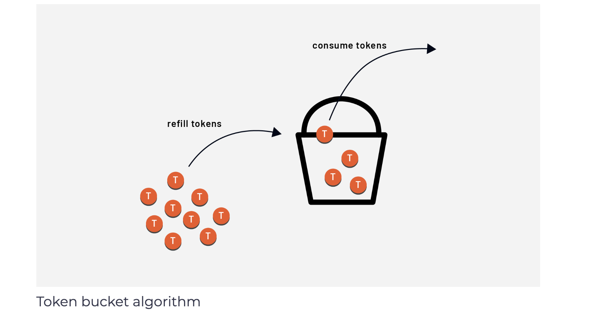
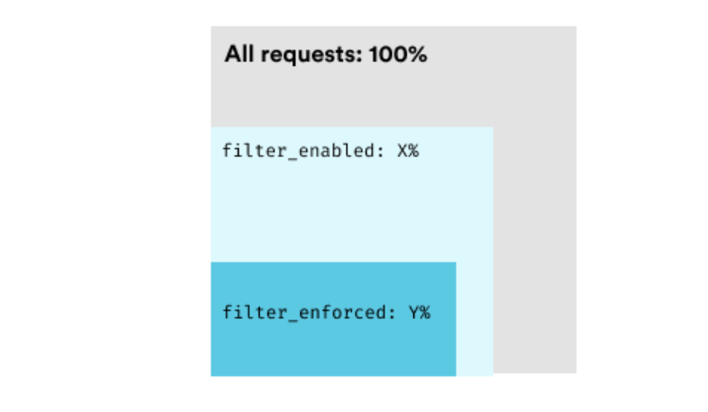

# Local Rate Limiting
The local rate limit filter applies a token bucket rate limit to incoming connections processed by the filter chain.

The basis of the token bucket algorithm is the analogy of tokens in a bucket. The bucket gets refilled with tokens at a fixed rate. Each time a request or connection is received, we check if any tokens are left in the bucket. If there are, a token gets removed from the bucket, and the request gets processed. If no tokens are left, the request gets dropped (i.e., rate-limited).

 </img>

The local rate limiting can be configured globally at the listener level, virtual host, or route level, just like the global rate limit. We can also combine the global and local rate limits in the same configuration.

The token_bucket specifies the configuration to use for requests processed by the filter. It includes the maximum number of tokens (max_tokens) bucket can hold, the number of tokens to add during each fill interval (tokens_per_refill), and the fill internal (fill_interval).

Here’s an example configuration for a bucket that can hold a maximum of 5000 tokens. Every 30 seconds, 100 tokens get added to the bucket. The bucket will never contain more than 5000 tokens.

```yaml
token_bucket:
  max_tokens: 5000
  tokens_per_fill: 100
  fill_interval: 30s
```

To control whether the token buckets are shared across all workers (i.e., per Envoy process) or used per-connection basis, we can set the local_rate_limit_per_downstream_connection field. The default value is false, which means rate limits get applied per Envoy process.

The two settings controlling if the rate limit is enabled or enforced for a certain fraction of the requests are called filter_enabled and filter_enforced. Both of these values are set to 0% by default.

A rate limit can be enabled but not necessarily enforced for a fraction of the requests. For example, we can enable the rate limit for 50% of the requests. Then, within those 50% of requests, we can enforce the rate limits.


 </img>


The following configuration enables and enforces rate limits for all incoming requests:

```yaml
token_bucket:
  max_tokens: 5000
  tokens_per_fill: 100
  fill_interval: 30s
filter_enabled:
  default_value:
    numerator: 100
    denominator: HUNDRED
filter_enforced:
  default_value:
    numerator: 100
    denominator: HUNDRED
```

We also can add request and response headers for rate-limited requests. We can provide a list of headers in the request_headers_to_add_when_not_enforced field and Envoy will add a request header to each rate-limited request forwarded upstream. Note that this will only happen when the filter is enabled but not enforced.

For the response headers, we can use response_headers_to_add field. We can provide a list of headers that will get added to the response of the requests that have been rate-limited. This will only happen when filters are either enabled or fully enforced.

If we build on the previous example, here’s an example of how to add specific response headers to all rate-limited requests:

```shell
token_bucket:
  max_tokens: 5000
  tokens_per_fill: 100
  fill_interval: 30s
filter_enabled:
  default_value:
    numerator: 100
    denominator: HUNDRED
filter_enforced:
  default_value:
    numerator: 100
    denominator: HUNDRED
response_headers_to_add:
  - append: false
    header:
      key: x-local-rate-limit
      value: 'true'
```
We can configure the local rate limiter such that all virtual hosts and routes share the same token buckets. To enable the local rate limit filter globally (not to be confused with the global rate limit filter), we can provide the configuration for it in the http_filters list.

For example:

```yaml
...
http_filters:
- name: envoy.filters.http.local_ratelimit
  typed_config:
    "@type": type.googleapis.com/envoy.extensions.filters.http.local_ratelimit.v3.LocalRateLimit
    stat_prefix: http_local_rate_limiter
    token_bucket:
      max_tokens: 10000
    ...
- name: envoy.filters.http.router
...
```

If we want to enable the local rate limit per route, we still have to add the filter to the http_filters list without any configuration. Then, in the route configuration, we can use  typed_per_filter_config and specify the local rate limit filter configuration.

For example:


```yaml
...
route_config:
  name: my_route
  virtual_hosts:
  - name: my_service
    domains: ["*"]
    routes:
    - match:
        prefix: /
      route:
        cluster: some_cluster
      typed_per_filter_config:
        envoy.filters.http.local_ratelimit:
          "@type": type.googleapis.com/envoy.extensions.filters.http.local_ratelimit.v3.LocalRateLimit
          token_bucket:
              max_tokens: 10000
              tokens_per_fill: 1000
              fill_interval: 1s
            filter_enabled:
              default_value:
                numerator: 100
                denominator: HUNDRED
            filter_enforced:
              default_value:
                numerator: 100
                denominator: HUNDRED
http_filters:
- name: envoy.filters.http.local_ratelimit
  typed_config:
    "@type": type.googleapis.com/envoy.extensions.filters.http.local_ratelimit.v3.LocalRateLimit
    stat_prefix: http_local_rate_limiter
- name: envoy.filters.http.router
```

The above configuration loads the local rate limit filter in the http_filter list. We configure it within the route configuration by using typed_per_filter_config and referring to the filter by name envoy.filters.http.local_ratelimit.

## Using descriptors for local rate limiting

Like we used descriptors when doing global rate limiting, we can also use them for local per-route rate limiting. We need to configure two parts: the actions on the routes and the descriptors list in the local rate limit filter configuration.

We can define actions for the local rate limit in the same way we defined them for the global rate limits:

```yaml
...
route_config:
  name: my_route
  virtual_hosts:
  - name: my_service
    domains: ["*"]
    routes:
    - match:
        prefix: /
      route:
        cluster: some_cluster
        rate_limits:
        - actions:
          - header_value_match:
              descriptor_value: post_request
              headers:
              - name: ":method"
                exact_match: POST
          - header_value_match:
              descriptor_value: get_request
              headers:
              - name: ":method"
                exact_match: GET
...
```

The second part is writing the configuration to match the generated descriptors and providing the token bucket information. This gets done in the rate limit filter configuration under the descriptors field.
For example:

```yaml
typed_per_filter_config:
  envoy.filters.http.local_ratelimit:
    "@type": type.googleapis.com/envoy.extensions.filters.http.local_ratelimit.v3.LocalRateLimit
    stat_prefix: some_stat_prefix
    token_bucket:
      max_tokens: 1000
      tokens_per_fill: 1000
      fill_interval: 60s
    filter_enabled:
    ...
    filter_enforced:
    ...
    descriptors:
    - entries:
      - key: header_match
        value: post_request
      token_bucket:
        max_tokens: 20
        tokens_per_fill: 5
        fill_interval: 30s
    - entries:
      - key: header_match
        value: get_request
      token_bucket:
        max_tokens: 50
        tokens_per_fill: 5
        fill_interval: 20s
...
```
For all POST requests (i.e. ("header_match": "post_request")) the bucket is set to 20 tokens and refills every 30 seconds with 5 tokens. For all GET requests, the bucket can hold a maximum of 50 tokens and refills every 20 seconds with 5 tokens.


