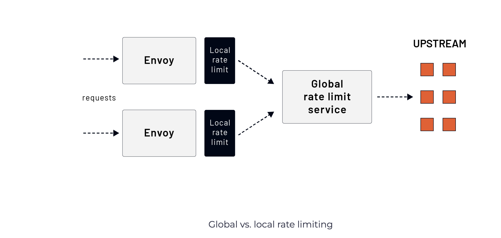

# Rate Limiting Introduction
Rate limiting is a strategy for limiting incoming requests. It specifies how often a host or a client sends a request within a specific timeframe. Once it reaches the limit, for example, 100 requests per second, we say that the client making the call is rate limited. Any rate-limited requests are rejected and never reach the upstream service. Later on, we’ll also talk about circuit breakers that can be used and how rate limits can limit the load to upstreams and prevent cascading failures.

Envoy supports rate limiting at the global (distributed) and local (non-distributed) levels.

The difference between global and local rate limiting is that we’re trying to control access to a set of upstreams shared between multiple Envoy instances with the global rate limit. For example, we want to rate limit access to a database called by multiple Envoy proxies. On the other hand, the local rate limit applies per Envoy instance.

 </img>

Both local and global rate limits can be used together, and Envoy applies them in two stages. First, the local rate limit is applied, then the global rate limit.

In the upcoming sections, we’ll dive deeper into the global and local rate-limiting and explain how both scenarios work