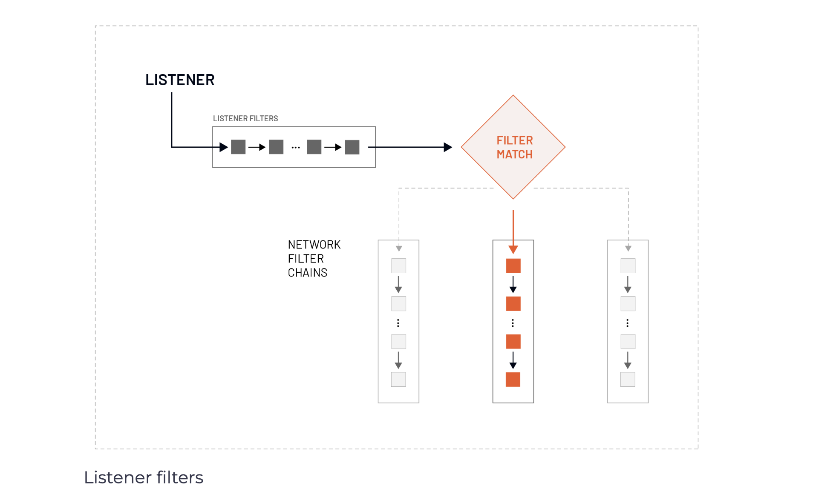

# Listener filters

As mentioned in the introduction chapter, the listener subsystem handles the downstream or incoming request processing. The listener subsystem is responsible for incoming requests and the response path to the client. In addition to defining which addresses and ports Envoy “listens” on for incoming requests, we can optionally configure each listener with listener filters.

Let’s not confuse the listener filters with the network filter chains and the L3/L4 filters we discussed earlier. Envoy processes the listener filters before it processes the network-level filters, as shown in the figure below.

 </img>

Note that operating Envoy without any listener filters is not untypical.

Envoy processes the listener filters before the network level filters. We can manipulate the connection metadata within the listener filters, usually to influence how later filters or clusters process the connection.

The listener filters operate on newly accepted sockets and can stop or subsequently continue execution to further filters. The order of the listener filters matters as Envoy processes them sequentially right after the listener accepts a socket and before the connection is created.

We can use the results from the listener filters to do the filter matching and select an appropriate network filter chain. For example, we could use an HTTP inspector listener filter to determine the HTTP protocol (HTTP/1.1 or HTTP/2). Based on the results, we can then select and run different network filter chains.

## Filters

1. Filter Chain Matching 
2. HTTP Inspector Listener
3. Match Application and Application protocol 
4. Original Destination listener filter 
5. Original Destination listener filter lab
6. Proxy protocol listener filter
7. TLS inspector lister filter 
8. TLS inspector lister filter Lab
9. Original Source Listener filter