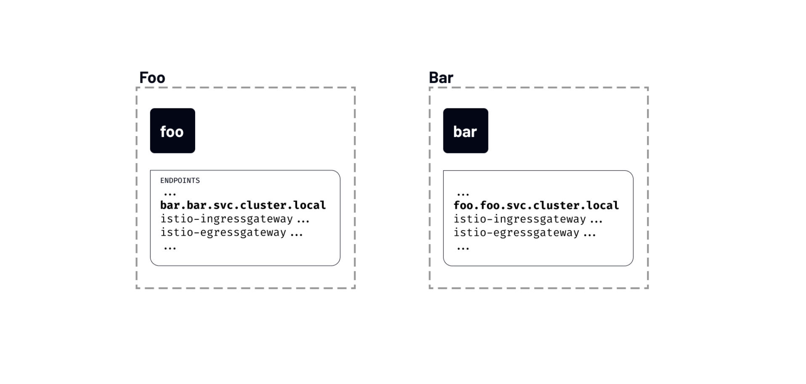

# Discovery Selectors

Discovery selectors were one of the new features introduced in Istio 1.10. Discovery selectors allow us to control which namespaces Istio control plane watches and sends configuration updates for.

By default, the Istio control plane watches and processes updates for all Kubernetes resources in a cluster. All Envoy proxies in the mesh are configured so that they can reach every workload in the mesh and accept traffic on all ports associated with the workloads.

For example, we have deployed two workloads in separate namespaces — foo and bar. Even though we know that foo will never have to talk to bar and the other way around, the endpoints of one service will be included in the list of discovered endpoints of the other service.

</img>

If we run istioctl proxy-config command to list all endpoints that the foo workload from the foo namespace can see, you’ll notice an entry for the service called bar:

```shell
$ istioctl proxy-config endpoints deploy/foo.foo
ENDPOINT                         STATUS      OUTLIER CHECK     CLUSTER
…
10.4.1.4:31400                   HEALTHY     OK                outbound|31400||istio-ingressgateway.istio-system.svc.cluster.local
10.4.1.5:80                      HEALTHY     OK                outbound|80||foo.foo.svc.cluster.local
10.4.2.2:53                      HEALTHY     OK                outbound|53||kube-dns.kube-system.svc.cluster.local
10.4.4.2:8383                    HEALTHY     OK                outbound|8383||istio-operator.istio-operator.svc.cluster.local
10.4.4.3:8080                    HEALTHY     OK                outbound|80||istio-egressgateway.istio-system.svc.cluster.local
10.4.4.3:8443                    HEALTHY     OK                outbound|443||istio-egressgateway.istio-system.svc.cluster.local
10.4.4.4:80                      HEALTHY     OK                outbound|80||bar.bar.svc.cluster.local
...
```

If Istio keeps updating the proxies with information about every service in the cluster, even though they’re unrelated, we can imagine how this can slow things down.

If this sounds familiar, you probably know that there’s a solution for this already– it’s called the Sidecar resource.

We’ll talk about the Sidecar resource in a later module.

## Configuring discovery selectors
We can configure discovery selectors at the mesh level in MeshConfig. Discovery selectors are a set of Kubernetes selectors that specify the namespaces Istio watches and updates when pushing configuration to the sidecars.

Like with the Sidecar resource, the discoverySelectors can be used to limit the number of items watched and processed by Istio.

We can update the IstioOperator to include the discoverySelectors field as shown below:

```yaml
apiVersion: install.istio.io/v1alpha1
kind: IstioOperator
metadata:
  namespace: istio-system
  name: istio-demo
spec:
  meshConfig:
    discoverySelectors:
    - matchLabels:
        env: test
```

The above example sets the env=test as a match label. That means the list of namespaces Istio watches and updates will include workloads in namespaces labeled with env=test.

If we label the foo namespace with env=test label and then list the endpoints, we’ll notice there are not as many endpoints listed in the configuration now. That’s because the only namespace we labeled is the foo namespace, and that’s the only namespace the Istio control plane watches and sends updates for.

```shell
$ istioctl proxy-config endpoints deploy/foo.foo
ENDPOINT                         STATUS      OUTLIER CHECK     CLUSTER
10.4.1.5:80                      HEALTHY     OK                outbound|80||foo.foo.svc.cluster.local
127.0.0.1:15000                  HEALTHY     OK                prometheus_stats
127.0.0.1:15020                  HEALTHY     OK                agent
unix://./etc/istio/proxy/SDS     HEALTHY     OK                sds-grpc
unix://./etc/istio/proxy/XDS     HEALTHY     OK                xds-grpc
```

If we label the namespace bar as well and then re-run the istioctl proxy-config command, we’ll notice the bar endpoint shows up as part of the configuration for the foo service.

```shell
$ istioctl proxy-config endpoints deploy/foo.foo
ENDPOINT                         STATUS      OUTLIER CHECK     CLUSTER
10.4.1.5:80                      HEALTHY     OK                outbound|80||foo.foo.svc.cluster.local
10.4.4.4:80                      HEALTHY     OK                outbound|80||bar.bar.svc.cluster.local
127.0.0.1:15000                  HEALTHY     OK                prometheus_stats
127.0.0.1:15020                  HEALTHY     OK                agent
unix://./etc/istio/proxy/SDS     HEALTHY     OK                sds-grpc
unix://./etc/istio/proxy/XDS     HEALTHY     OK                xds-grpc
```