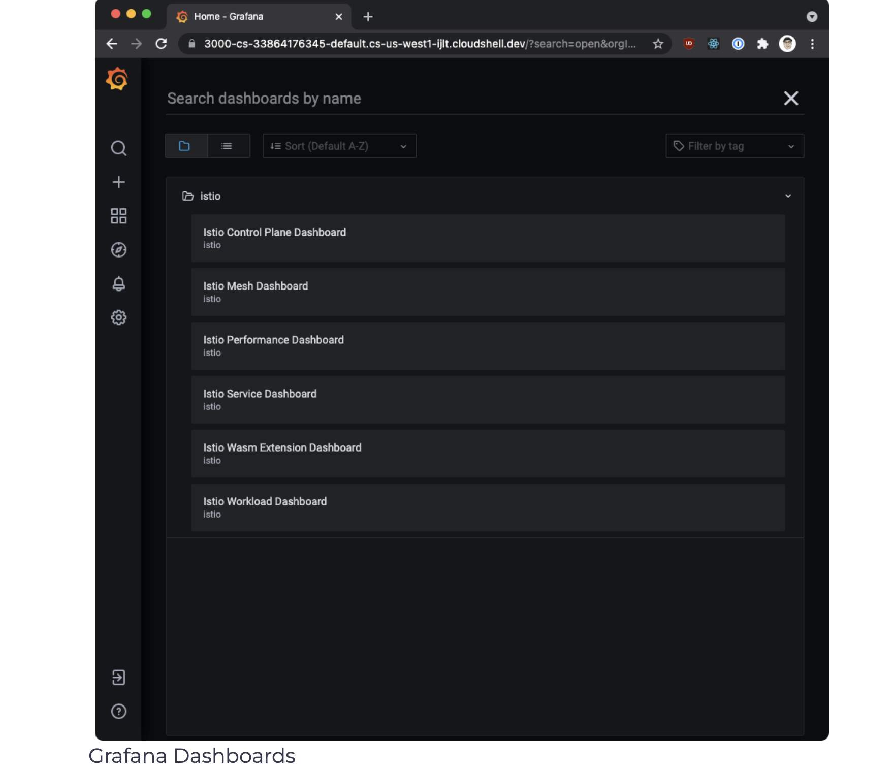
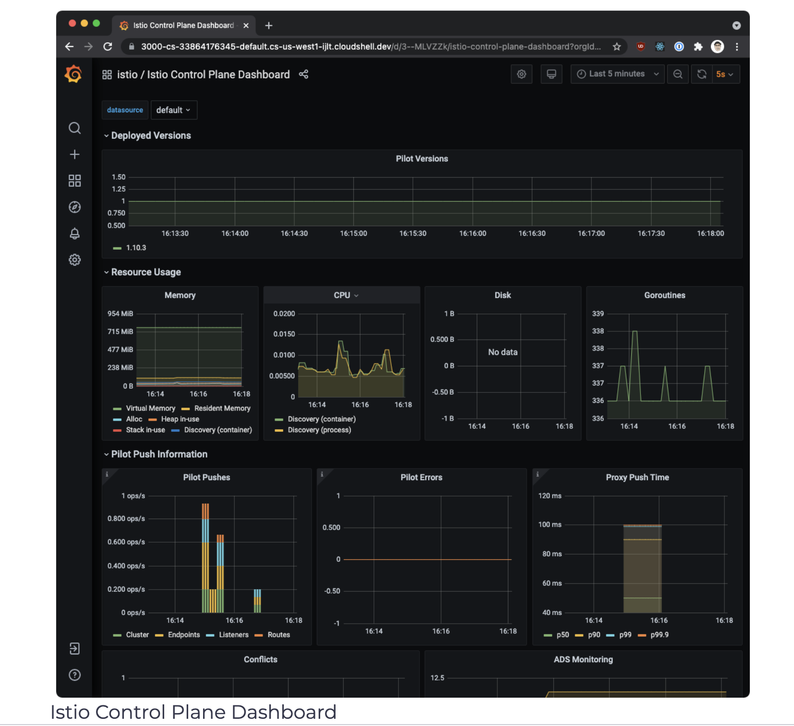
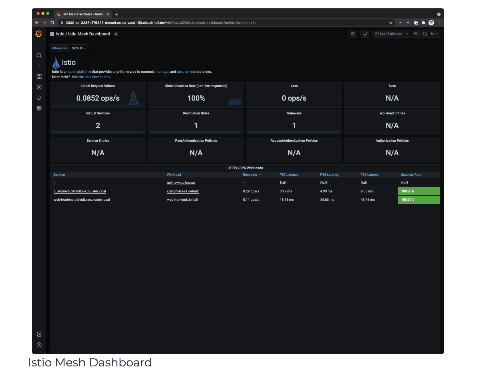
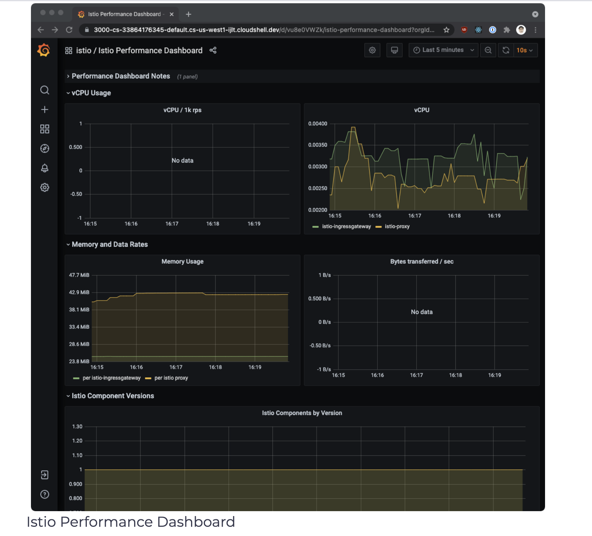
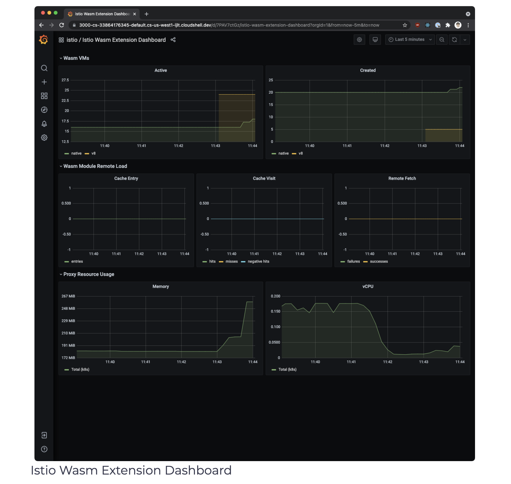
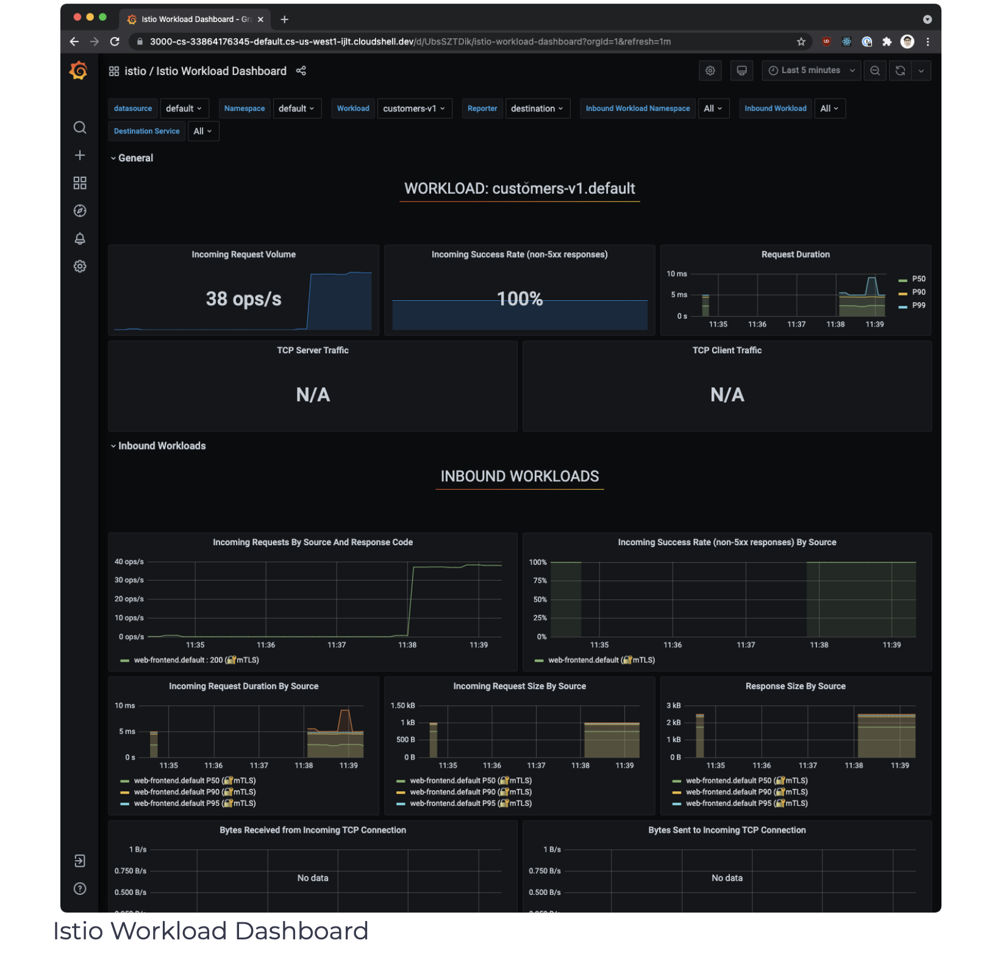

# Grafana Dashboards
[Grafana](https://grafana.com/) is an open platform for analytics and monitoring. Grafana can connect to various data sources and visualizes the data using graphs, tables, heatmaps, etc. With a powerful query language, you can customize the existing dashboard and create more advanced visualizations.

With Grafana, we can monitor the health of Istio installation and applications running in the service mesh.

We can use the grafana.yaml to deploy a sample installation of Grafana with pre-configured dashboards.

Ensure you deploy the Prometheus add-on before deploying Grafana, as Grafana uses Prometheus as its data source.

Run the following command to deploy Grafana with pre-configured dashboards:

```shell
$ kubectl apply -f https://raw.githubusercontent.com/istio/istio/release-1.10/samples/addons/grafana.yaml
serviceaccount/grafana created
configmap/grafana created
service/grafana created
deployment.apps/grafana created
configmap/istio-grafana-dashboards created
configmap/istio-services-grafana-dashboards created
```

> This Grafana installation is not intended for running in production, as it’s not tuned for performance or security.

Kubernetes deploys Grafana in the istio-system namespace. To access Grafana, we can use the getmesh istioctl dashboard command:

```shell
$ getmesh istioctl dashboard grafana
http://localhost:3000
```

We can open http://localhost:3000 in the browser to go to Grafana. Then, click Home and the istio folder to see the installed dashboards, as shown in the figure below.

</img>


The Istio Grafana installation comes pre-configured with the following dashboards:

1. Istio Control Plane Dashboard
From the Istio control plane dashboard, we can monitor the health and performance of the Istio control plane.

</img>


This dashboard will show us the control plane’s resource usage (memory, CPU, disk, Go routines) and information about the pilot, Envoy, and webhooks.

2. Istio Mesh Dashboard
The mesh dashboard provides us an overview of all services running in the mesh. The dashboard includes the global request volume, success rate, and the number of 4xx and 5xx responses.

</img>

3. Istio Performance Dashboard
The performance dashboard shows us the Istio main components cost in resource utilization under a steady load.

</img>

4. Istio Service Dashboard
The service dashboard allows us to view details about our services in the mesh.

We can get information about the request volume, success rate, durations, and detailed graphs showing incoming requests by source and response code, duration, and size.

</img>

5. Istio Wasm Extension Dashboard
The Istio Wasm extension dashboards show the metrics related to WebAssembly modules. From this dashboard, we can monitor the active and created Wasm VMs, data about fetching remote Wasm modules, and proxy resource usage.
</img>


6. Istio Workload Dashboard
This dashboard provides us a detailed breakdown of metrics for a workload.

</img>


