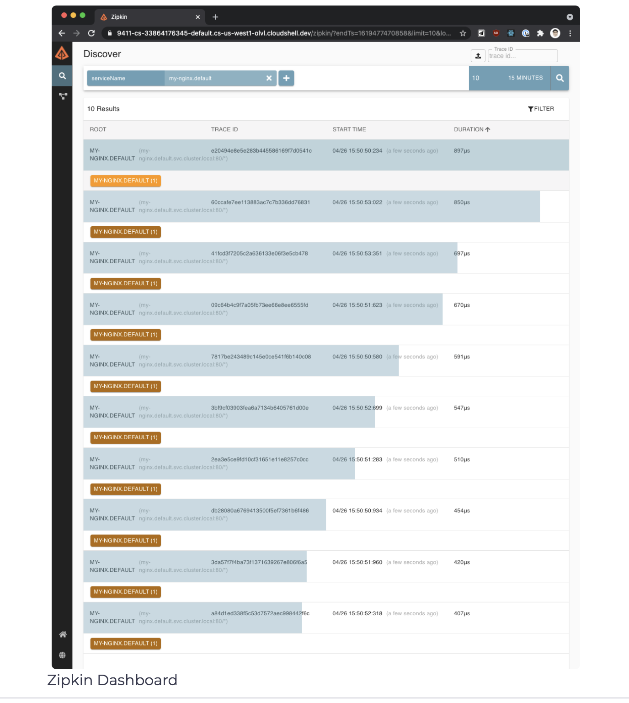

# What is distributed tracing?
Distributed tracing is a method for monitoring microservice applications. Using distributed tracing, we can follow the requests as they travel through the different pieces of the system being monitored.

Envoy generates a unique request ID and tracing information and stores it as part of HTTP headers whenever a request enters the service mesh. Any application can then forward these headers to other services to create a full trace through the system.

A distributed trace is a collection of **spans**. As requests flow through different system components, each component contributes a **span**. Each span has a name, start and finish timestamp, a set of key-value pairs called **tags** and **logs**, and a span context.

Tags get applied to the whole span, and we can use them for querying and filtering. Here’s a couple of examples of tags we’ll see when using Zipkin. Note that some of these are generic, and some of them are Istio specific:

* istio.mesh_id
* istio.canonical_service
* upstream_cluster
* http.url
* http.status_code
* zone

The individual spans and the context headers that identify the span, parent span, and trace ID get sent to the collector component. The collector validates, indexes and stores the data.

The Envoy proxies automatically send the individual spans as the requests flow through them. Note that Envoy can only collect spans at the edges. We’re responsible for generating any other spans within each application and ensuring that we forward the tracing headers whenever we make calls to other services. This way, the individual spans can be correlated correctly into a single trace.

</img>

## Distributed Tracing with Zipkin
Zipkin is a distributed tracing system. We can easily monitor distributed transactions in the service mesh and discover any performance or latency issues.

For our services to participate in a distributed trace, we need to propagate HTTP headers from the services when making any downstream service calls. Even though all requests go through an Istio sidecar, Istio has no way of correlating the outbound requests to the inbound requests that caused them. By propagating the relevant headers from your applications, you can help Zipkin stitch together the traces.

Istio relies on B3 trace headers (headers starting with x-b3) and the Envoy-generated request ID (x-request-id). The B3 headers are used for trace context propagation across service boundaries.

Here are the specific header names we need to propagate in our applications with each outgoing request:

```
x-request-id
x-b3-traceid
x-b3-spanid
x-b3-parentspanid
x-b3-sampled
x-b3-flags
b3
```

> If you’re using Lightstep, you also need to forward the header called x-ot-span-context.

The most common way to propagate the headers is to copy them from the incoming request and include them in all outgoing requests made from your applications.

Traces you get with Istio service mesh get captured at the service boundaries. To understand the application behavior and troubleshoot problems, you need to instrument your applications by creating additional spans properly.

To install Zipkin, we can use the zipkin.yaml file:

```shell
$ kubectl apply -f https://raw.githubusercontent.com/istio/istio/release-1.10/samples/addons/extras/zipkin.yaml
deployment.apps/zipkin created
service/tracing created
service/zipkin created
```

We can open the Zipkin dashboard by running getmesh istioctl dashboard zipkin. From the UI we can select the criteria for the trace lookups. Click the button and select serviceName and then my-nginx.default service from the dropdown and click the search button (or press Enter) to search the traces.

</img>

We can click on individual traces to dig deeper into the different spans. The detailed view will show us the duration of calls between the services and the request details, such as method, protocol, status code, and similar. Since we only have one service running (Nginx), you won’t see many details. Later on, we will return to Zipkin and explore the traces in more detail.

</img>

## Mesh Observability with Kiali

[Kiali](https://www.kiali.io/) is a management console for Istio-based service mesh. It provides dashboards, observability and lets us operate the mesh with robust configuration and validation capabilities. It shows the service mesh structure by inferring traffic topology and displays the health of the mesh. Kiali provides detailed metrics, robust validation, Grafana access, and strong integration for distributed tracing with Jaeger.

To install Kiali, use the kiali.yaml file:

```shell
$ kubectl apply -f https://raw.githubusercontent.com/istio/istio/release-1.10/samples/addons/kiali.yaml
customresourcedefinition.apiextensions.k8s.io/monitoringdashboards.monito
ring.kiali.io created
serviceaccount/kiali created
configmap/kiali created
clusterrole.rbac.authorization.k8s.io/kiali-viewer created
clusterrole.rbac.authorization.k8s.io/kiali created
clusterrolebinding.rbac.authorization.k8s.io/kiali created
service/kiali created
deployment.apps/kiali created
```

Note that if you see any errors such as no matches for kind "MonitoringDashboard" in version "monitoringkiali.io/v1alpha", re-run the kubectl apply command again. The issue is that there might be a race condition when installing the CRD (custom resource definition) and resources that that CRD defines.

We can open Kiali using getmesh istioctl dashboard kiali.

Kiali can generate a service graph like the one in the figure below.

</img>

The graph shows us the service topology and visualizes how the services communicate. It also shows the inbound and outbound metrics and traces by connecting to Jaeger and Grafana (if installed). Colors in the graph represent the health of the service mesh. A node colored red or orange might need attention. The color of an edge between components represents the health of the requests between those components. The node shape indicates the type of components, such as services, workloads, or apps.

The health of nodes and edges gets refreshed automatically based on the user’s preference. We can also pause the graph to examine a particular state or replay it to re-examine a specific period.

Kiali provides actions to create, update, and delete Istio configuration driven by wizards. We can configure request routing, fault injection, traffic shifting, and request timeouts, all from the UI. If any existing Istio configuration is already deployed, Kiali can validate it and report any warnings or errors.