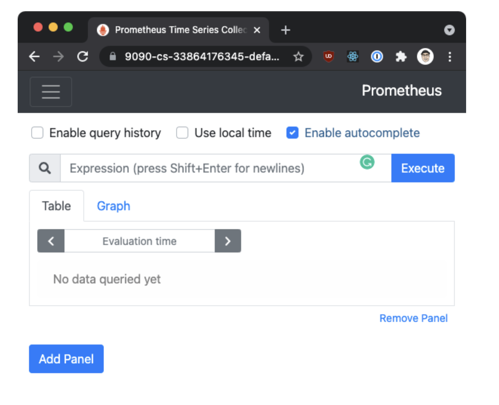

# Observability
Thanks to the sidecar deployment model where Envoy proxies run next to application instances and intercept the traffic, these proxies also collect metrics.

The metrics Envoy proxies collect and helping us get visibility into the state of your system. Gaining this visibility into our systems is critical because we need to understand what’s happening and empower the operators to troubleshoot, maintain, and optimize applications.

Istio generates three types of telemetry to provide observability to services in the mesh:

* Metrics
* Distributed traces
* Access logs

## Metrics
Istio generates metrics based on the four golden signals: latency, traffic, errors, and saturation.

**Latency** represents the time it takes to service a request. These metrics should be broken down into latency of successful requests (e.g., HTTP 200) and failed requests (e.g., HTTP 500).

**Traffic** measures how much demand gets placed on the system, and it’s measured in system-specific metrics. For example, HTTP requests per second, or concurrent sessions, retrievals per second, and so on.

**Errors** measures the rate of failed requests (e.g., HTTP 500s).

**Saturation** measures how full the most constrained resources of service are. For example, utilization of a thread pool.

The metrics are collected at different levels, starting with the most granular, the Envoy proxy-level, then the service-level and control plane metrics.

## Proxy-level metrics
Envoy has a crucial role in generating metrics. It generates a rich set of metrics about all traffic passing through it. Using the metrics generated by Envoy, we can monitor the mesh at the lowest granularity, for example, metrics for individual listeners and clusters in the Envoy proxy.

We can control which Envoy metrics get generated and collected at each workload instance as a mesh operator.

Here’s an example of a couple of proxy-level metrics:

```shell
envoy_cluster_internal_upstream_rq{response_code_class="2xx",cluster_name="xds-grpc"} 7163
envoy_cluster_upstream_rq_completed{cluster_name="xds-grpc"} 7164
envoy_cluster_ssl_connection_error{cluster_name="xds-grpc"} 0
envoy_cluster_lb_subsets_removed{cluster_name="xds-grpc"} 0
envoy_cluster_internal_upstream_rq{response_code="503",cluster_name="xds-grpc"} 1
```

> Note you can view the proxy-level metrics from the /stats endpoint on every Envoy proxy instance.

## Service-level metrics
The service level metrics cover the four golden signals we mentioned earlier. These metrics allow us to monitor service-to-service communication. Additionally, Istio comes with **dashboards** to monitor the service behavior based on these metrics.

Just like with the proxy-level metrics, the operator can customize which service-level metrics Istio collects.

Istio exports the [standard set of metrics](https://istio.io/latest/docs/reference/config/metrics/) to Prometheus by default.

Here’s an example of a couple of service-level metrics:

```shell
istio_requests_total{
    response_code="200",
    reporter="destination",
    source_workload="istio-ingressgateway",
    source_workload_namespace="istio-system",
    source_principal="spiffe://cluster.local/ns/istio-system/sa/istio-ingressgateway-service-account",
    source_app="istio-ingressgateway",
    source_version="unknown",
    source_cluster="Kubernetes",
    destination_workload="web-frontend",
    destination_workload_namespace="default",
    destination_principal="spiffe://cluster.local/ns/default/sa/default",destination_app="web-frontend",
    destination_version="v1",
    destination_service="web-frontend.default.svc.cluster.local",destination_service_name="web-frontend",
    destination_service_namespace="default",
    destination_cluster="Kubernetes",
    request_protocol="http",
    response_flags="-",
    grpc_response_status="",
    connection_security_policy="mutual_tls",source_canonical_service="istio-ingressgateway",destination_canonical_service="web-frontend",
    source_canonical_revision="latest",destination_canonical_revision="v1"
} 9
```

## Control plane metrics
Istio also emits control plane metrics that can help monitor the control plane and behavior of Istio, not user services.

You can find the full list of exported control plane metrics [here](https://istio.io/latest/docs/reference/commands/pilot-discovery/#metrics).

The control plane metrics include the number of conflicting inbound/outbound listeners, the number of clusters without instances, rejected or ignored configurations, and so on.

## Prometheus
Prometheus is an open-source monitoring system and time series database. Istio uses Prometheus to record metrics that track the health of Istio and applications in the mesh.

To install Prometheus, we can use the sample installation file;

```shell
$ kubectl apply -f https://raw.githubusercontent.com/istio/istio/release-1.10/samples/addons/prometheus.yaml
serviceaccount/prometheus created
configmap/prometheus created
clusterrole.rbac.authorization.k8s.io/prometheus created
clusterrolebinding.rbac.authorization.k8s.io/prometheus created
service/prometheus created
deployment.apps/prometheus created
```

To open the Prometheus dashboard, we can use the dashboard command in the Istio CLI:

```shell
$ getmesh istioctl dashboard prometheus
http://localhost:9090
```

As shown in the figure below, we can now open http://localhost:9090 in a browser to access the Prometheus dashboard.

</img>

## Deploying a sample app
To see some requests and traffic we will deploy an Nginx instance:

```shell
$ kubectl create deploy my-nginx --image=nginx
deployment.apps/my-nginx created
```

To generate some traffic and access the Nginx Pod, we need to make it accessible somehow.
The simplest way is to expose the Nginx deployment as a Kubernetes LoadBalancer service:

kubectl expose deployment my-nginx --type=LoadBalancer --name=my-nginx --port 80
Note: later in the course, we will learn how to use Istio resources and expose the services through Istios’ ingress gateway.

Now we can run kubectl get services and get the external IP address of the my-nginx services:

```shell
$ kubectl get svc
NAME         TYPE           CLUSTER-IP   EXTERNAL-IP      PORT(S)        AGE
kubernetes   ClusterIP      10.48.0.1    <none>           443/TCP        73m
my-nginx     LoadBalancer   10.48.0.94   [IP HERE]   80:31191/TCP   4m6s
```

Let’s store that IP address as an environment variable so we can use it throughout this lab:

```shell
export NGINX_IP=$(kubectl get service my-nginx -o jsonpath='{.status.loadBalancer.ingress[0].ip}')
```

You can now run curl against the above IP and you should get back the default Nginx page:

```shell
$ curl $NGINX_IP
<!DOCTYPE html>
<html>
<head>
<title>Welcome to nginx!</title>
<style>
    body {
        width: 35em;
        margin: 0 auto;
        font-family: Tahoma, Verdana, Arial, sans-serif;
    }
</style>
</head>
<body>
<h1>Welcome to nginx!</h1>
<p>If you see this page, the nginx web server is successfully installed and
working. Further configuration is required.</p>

<p>For online documentation and support please refer to
<a href="http://nginx.org/">nginx.org</a>.<br/>
Commercial support is available at
<a href="http://nginx.com/">nginx.com</a>.</p>

<p><em>Thank you for using nginx.</em></p>
</body>
</html>
```

Let’s make a couple of requests to the $NGINX_IP environment variable we’ve created initially. Then, from the Prometheus UI, you can search for one of the Istio metrics (istio_requests_total, for example) to understand which data points are being collected.

Here’s an example element from the Prometheus UI:

```json
istio_requests_total{app="my-nginx", connection_security_policy="none", destination_app="my-nginx", destination_canonical_revision="latest", destination_canonical_service="my-nginx", destination_cluster="Kubernetes", destination_principal="unknown", destination_service="my-nginx.default.svc.cluster.local", destination_service_name="my-nginx", destination_service_namespace="default", destination_version="unknown", destination_workload="my-nginx", destination_workload_namespace="default", instance="10.92.4.4:15020", istio_io_rev="default", job="kubernetes-pods", kubernetes_namespace="default", kubernetes_pod_name="my-nginx-6b74b79f57-r59sf", pod_template_hash="6b74b79f57", reporter="destination", request_protocol="http", response_code="200", response_flags="-", security_istio_io_tlsMode="istio", service_istio_io_canonical_name="my-nginx", service_istio_io_canonical_revision="latest", source_app="unknown", source_canonical_revision="latest", source_canonical_service="unknown", source_cluster="unknown", source_principal="unknown", source_version="unknown", source_workload="unknown", source_workload_namespace="unknown"}  12
```

