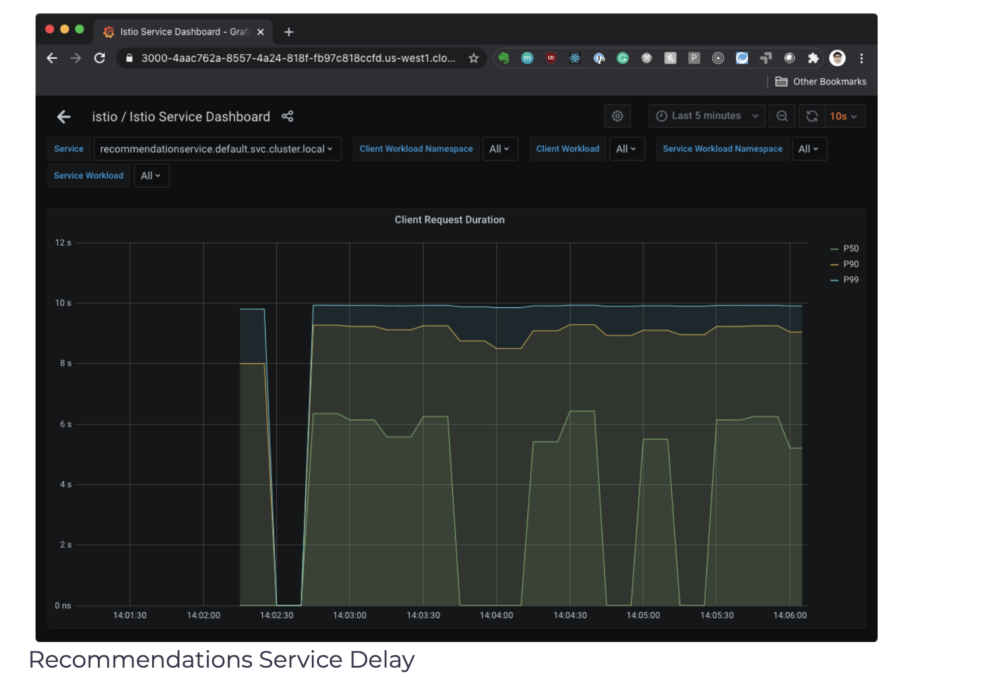
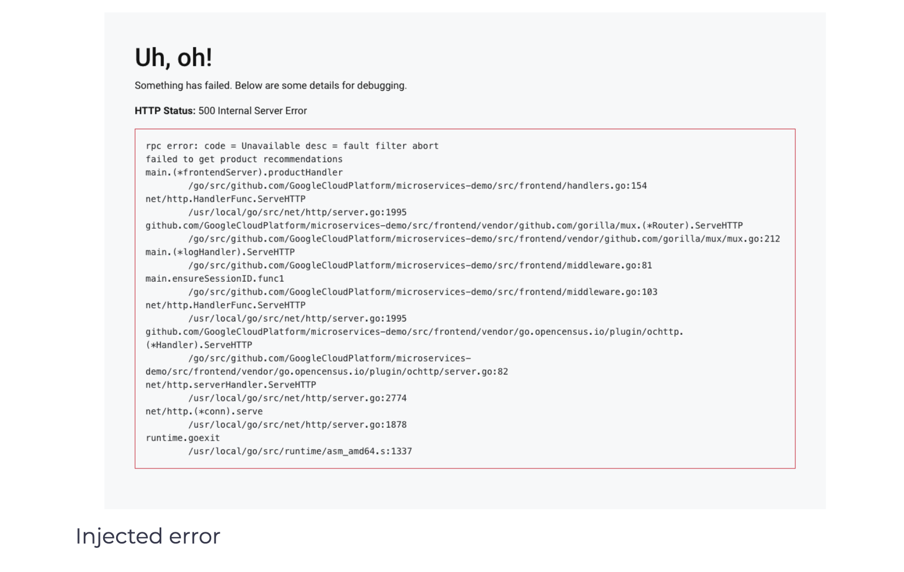

## Fault injection
In this section, we will introduce a 5-second delay to the recommendations service. Envoy will inject the delay for 50% of the requests.

```yaml
apiVersion: networking.istio.io/v1alpha3
kind: VirtualService
metadata:
  name: recommendationservice
spec:
  hosts:
  - recommendationservice
  http:
  - route:
      - destination:
          host: recommendationservice
    fault:
      delay:
        percentage:
          value: 50
        fixedDelay: 5s
```

Save the above YAML to recommendation-delay.yaml and create the VirtualService with kubectl apply -f recommendation-delay.yaml.

We can open the INGRESS_HOST in the browser, then click on one of the products. The results from the recommendation service shown at the bottom of the screen in a section titled “Other Products You Might Like”. If we refresh the page a couple of times, we will notice that the page either loads right away or there’s a delay loading the page. This delay is due to the 5-second delay we injected.

We can open Grafana (istioctl dash grafana) and the Istio Service Dashboard. Make sure to select the recommendationsservice from the Service list and look at the Client Request Duration that shows the delay, as shown in the following figure.


</img>

Similarly, we can inject an abort. In the example below, we inject an HTTP 500 for 50% of the requests sent to the product catalog service.

```yaml
apiVersion: networking.istio.io/v1alpha3
kind: VirtualService
metadata:
  name: productcatalogservice
spec:
  hosts:
  - productcatalogservice
  http:
  - route:
      - destination:
          host: productcatalogservice
    fault:
      abort:
        percentage:
          value: 50
        httpStatus: 500
```

Save the above YAML to productcatalogservice-abort.yaml and update the VirtualService with kubectl apply -f productcatalogservice-abort.yaml.

If we refresh the product page a couple of times, we should get an error message like the one shown in the figure below.


</img>

Note that the error message says that the cause of the failure is fault filter abort. If we open Grafana (istioctl dash grafana), we will also notice the errors reported in the graphs.

We can delete the VirtualService by running kubectl delete vs productcatalogservice.

## files

### recommendationdelay-210119-085953.yaml

```yaml
apiVersion: networking.istio.io/v1alpha3
kind: VirtualService
metadata:
  name: recommendationservice
spec:
  hosts:
  - recommendationservice
  http:
  - route:
      - destination:
          host: recommendationservice
    fault:
      delay:
        percentage:
          value: 50
        fixedDelay: 5s
```

### productcatalogserviceabort-210119-085953.yaml
```yaml
apiVersion: networking.istio.io/v1alpha3
kind: VirtualService
metadata:
  name: productcatalogservice
spec:
  hosts:
  - productcatalogservice
  http:
  - route:
      - destination:
          host: productcatalogservice
    fault:
      abort:
        percentage:
          value: 50
        httpStatus: 500
```

