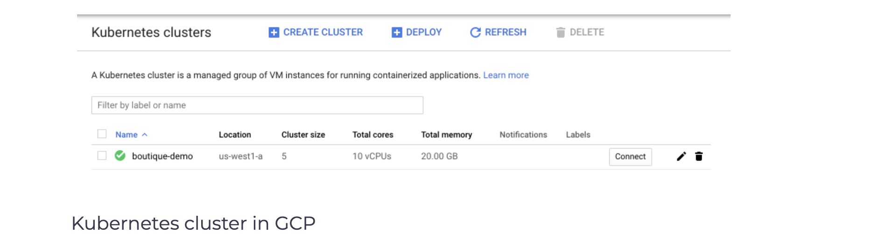

# Create a Cluster
We will use Google Cloud Platform to host the Kubernetes cluster. Open and login to your [GCP Console](https://console.cloud.google.com/) account, and follow the steps below to create a Kubernetes cluster.

1. From the Navigation, select Kubernetes Engine.

2. Click Create Cluster.

3. Name the cluster boutique-demo.

4. Select the Zonal option and pick the zone closest to your location.

5. Click the default-pool and enter 5 in the Number of nodes text.

6. Click the Nodes.

7. From the Machine Configuration Machine type drop-down, select e2-medium (2 vCPU, 4 GB memory).

8. Check the Enable preemptible nodes

9. Click Create to create the cluster.

Cluster creation will take a couple of minutes. Once the installation is complete, the cluster will show up in the list, as shown in the figure below.

</img>

> You can also deploy the Online Boutique application to Kubernetes cluster hosted on other cloud platforms, such as Azure or AWS.

## Accessing the cluster
We have two options to access the cluster. We can either use the Cloud Shell from the browser. To do so, click Connect next to the cluster and then click Run in Cloud Shell button. Clicking the button opens the Cloud Shell and configures Kubernetes CLI to access the cluster.

The second option is to install gcloud CLI on your computer and run the same command from your computer.

