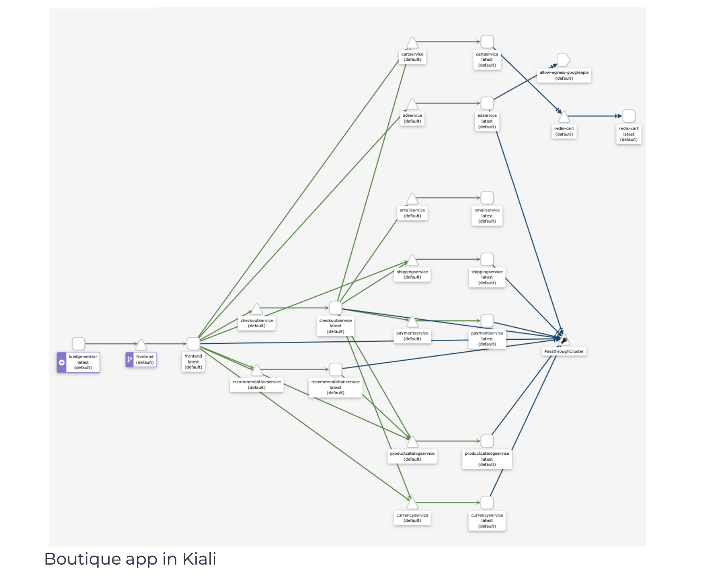

## Deploy Observability Tools
Next, we will deploy the observability, distributed tracing, and data visualization tools:

```shell
kubectl apply -f https://raw.githubusercontent.com/istio/istio/release-1.10/samples/addons/prometheus.yaml
kubectl apply -f https://raw.githubusercontent.com/istio/istio/release-1.10/samples/addons/grafana.yaml
kubectl apply -f https://raw.githubusercontent.com/istio/istio/release-1.10/samples/addons/kiali.yaml
kubectl apply -f https://raw.githubusercontent.com/istio/istio/release-1.10/samples/addons/extras/zipkin.yaml
```

> If you get the following error No matches for kind "MonitoringDashboard" in version "monitoring.kiali.io/v1alpha1" when installing Kiali, make sure you re-run the command again.

To open the dashboards from the Google Cloud Shell, we can run getmesh istioctl dash kiali command, for example, and then click the Web Preview button and select the port dashboard is running on (20001 for Kiali). If you are using your terminal, running the Istio CLI command is enough.

Here’s how the graph for the Boutique application looks like in Kiali:

</img>