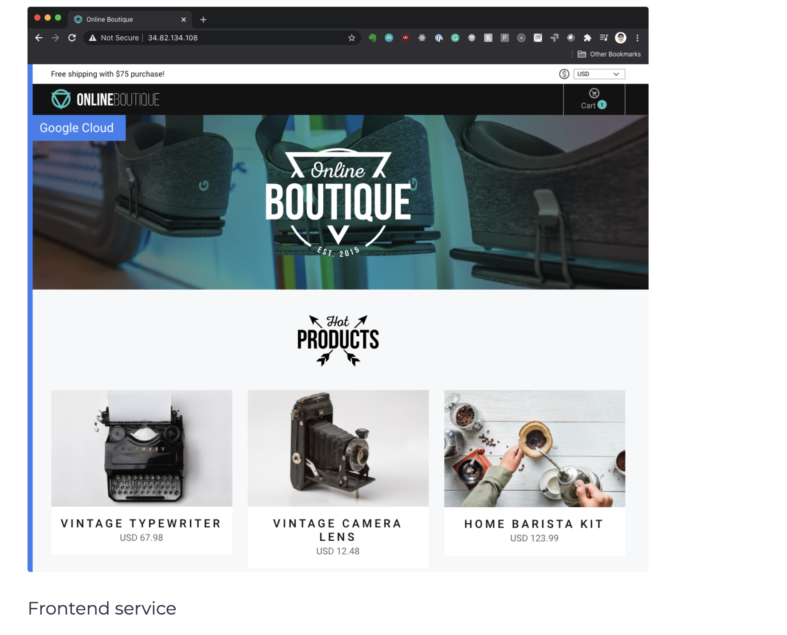

## Deploy Online Boutique Application
With cluster and Istio ready, we can clone the Online Boutique Application repository.

1. Clone the repository:

```shell
git clone https://github.com/GoogleCloudPlatform/microservices-demo.git
```

2. Go to the microservices-demo folder:

```shell
cd microservices-demo
```

3. Create the Kubernetes resources:

```shell
kubectl apply -f release/kubernetes-manifests.yaml
```

4. Check that all Pods are running:

```shell
$ kubectl get pods
NAME                                     READY   STATUS    RESTARTS   AGE
adservice-5c9c7c997f-n627f               2/2     Running   0          2m15s
cartservice-6d99678dd6-767fb             2/2     Running   2          2m16s
checkoutservice-779cb9bfdf-l2rs9         2/2     Running   0          2m18s
currencyservice-5db6c7d559-9drtc         2/2     Running   0          2m16s
emailservice-5c47dc87bf-dk7qv            2/2     Running   0          2m18s
frontend-5fcb8cdcdc-8c9dk                2/2     Running   0          2m17s
loadgenerator-79bff5bd57-q9qkd           2/2     Running   4          2m16s
paymentservice-6564cb7fb9-f6dwr          2/2     Running   0          2m17s
productcatalogservice-5db9444549-hkzv7   2/2     Running   0          2m17s
recommendationservice-ff6878cf5-jsghw    2/2     Running   0          2m18s
redis-cart-57bd646894-zb7ch              2/2     Running   0          2m15s
shippingservice-f47755f97-dk7k9          2/2     Running   0          2m15s
```

5. Create the Istio resources:

```shell
kubectl apply -f ./istio-manifests
```

Once we deployed everything, we can get the ingress gateways’ IP address and open the frontend service:

```shell
INGRESS_HOST="$(kubectl -n istio-system get service istio-ingressgateway \
   -o jsonpath='{.status.loadBalancer.ingress[0].ip}')"
echo "$INGRESS_HOST"
```

Open the INGRESS_HOST in the browser, and you’ll see the frontend service as shown in the following figure.

</img>

The last thing we need to do is to delete the frontend-external service. The frontend-external service is a LoadBalancer service that exposes the frontend. Since we are using Istio’s ingress gateway, we don’t need this LoadBalancer service anymore. Delete the service with kubectl delete svc frontend-external.

The Online Boutique Application manifest includes a load generator that is generating requests to all services - this is so we can simulate traffic to the website.

