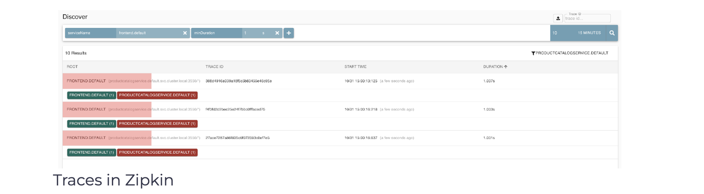

## Resiliency
To demonstrate resiliency features, we will add an environment variable called EXTRA_LATENCY to the product catalog service deployment. This variable injects an extra sleep on every call to the service.

Edit the product catalog service deployment by running kubectl edit deploy productcatalogservice. This opens an editor. Scroll to the section with the environment variables and add the EXTRA_LATENCY environment variable:

```yaml
...
    spec:
      containers:
      - env:
        - name: EXTRA_LATENCY
          value: 6s
...
```

If we refresh the page, we will notice the page takes 6 seconds to load - that’s due to the latency we injected.

Let’s add a 2-second timeout to the product catalog service.

```yaml
apiVersion: networking.istio.io/v1alpha3
kind: VirtualService
metadata:
  name: productcatalogservice
spec:
  hosts:
  - productcatalogservice
  http:
  - route:
    - destination:
        host: productcatalogservice
    timeout: 2s
```

Save the above YAML to productcatalogservice-timeout.yaml and create the VirtualService using kubectl apply -f productcatalogservice-timeout.yaml.

If we refresh the page, we will notice an error message show up:

rpc error: code = Unavailable desc = upstream request timeout
could not retrieve products
The error indicates that the request for product catalog service timed out. We modified the service with 6-second extra latency and set the timeout to 2 seconds.

Let’s define a retry policy with three attempts and a per try timeout of 1 second.

```yaml
apiVersion: networking.istio.io/v1alpha3
kind: VirtualService
metadata:
  name: productcatalogservice
spec:
  hosts:
  - productcatalogservice
  http:
  - route:
    - destination:
        host: productcatalogservice
    retries:
      attempts: 3
      perTryTimeout: 1s
```
Save the above to productcatalogservice-retry.yaml and update the VirtualService with kubectl apply -f productcatalogservice-retry.yaml.

Since we left the extra latency in the product catalog service deployment, we’ll still see errors. Let’s open Zipkin and look for the traces to see the retry policy in action.

Use istioctl dash zipkin to open the Zipkin dashboard. Click the + button, select serviceName and frontend.default. To only get the responses that took at least one second (that’s our perTryTimeout), select minDuration and enter 1s in the text box. Click the search button to show all traces.

Click the Filter button and select productCatalogService.default from the dropdown. You should see traces that took at 1 second. The traces correspond to  perTryTimeout we defined earlier.

</img>
To remove the VirtualService, run kubectl delete vs productcatalogservice.
