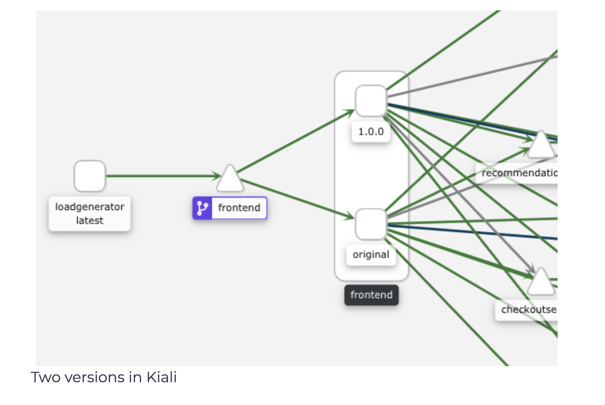

## Routing Traffic
We have built a new Docker image that uses a different header from the currently running frontend service. Let’s see how to deploy the required resources and route a percentage of the traffic to a different frontend service version.

Before we create any resources, let’s delete the existing frontend deployment (kubectl delete deploy frontend) and create on that has the version label set to original.

```yaml
apiVersion: apps/v1
kind: Deployment
metadata:
  name: frontend
spec:
  selector:
    matchLabels:
      app: frontend
      version: original
  template:
    metadata:
      labels:
        app: frontend
        version: original
      annotations:
        sidecar.istio.io/rewriteAppHTTPProbers: "true"
    spec:
      containers:
        - name: server
          image: gcr.io/google-samples/microservices-demo/frontend:v0.2.1
          ports:
          - containerPort: 8080
          readinessProbe:
            initialDelaySeconds: 10
            httpGet:
              path: "/_healthz"
              port: 8080
              httpHeaders:
              - name: "Cookie"
                value: "shop_session-id=x-readiness-probe"
          livenessProbe:
            initialDelaySeconds: 10
            httpGet:
              path: "/_healthz"
              port: 8080
              httpHeaders:
              - name: "Cookie"
                value: "shop_session-id=x-liveness-probe"
          env:
          - name: PORT
            value: "8080"
          - name: PRODUCT_CATALOG_SERVICE_ADDR
            value: "productcatalogservice:3550"
          - name: CURRENCY_SERVICE_ADDR
            value: "currencyservice:7000"
          - name: CART_SERVICE_ADDR
            value: "cartservice:7070"
          - name: RECOMMENDATION_SERVICE_ADDR
            value: "recommendationservice:8080"
          - name: SHIPPING_SERVICE_ADDR
            value: "shippingservice:50051"
          - name: CHECKOUT_SERVICE_ADDR
            value: "checkoutservice:5050"
          - name: AD_SERVICE_ADDR
            value: "adservice:9555"
          - name: ENV_PLATFORM
            value: "gcp"
          resources:
            requests:
              cpu: 100m
              memory: 64Mi
            limits:
              cpu: 200m
              memory: 128Mi
```

Save the above file to frontend-original.yaml and create the deployment with kubectl apply -f frontend-original.yaml.

Now we are ready to create a DestinationRule that defines the two versions of the frontend - the existing one (original) and the new one called (v1).

```yaml
apiVersion: networking.istio.io/v1alpha3
kind: DestinationRule
metadata:
  name: frontend
spec:
  host: frontend.default.svc.cluster.local
  subsets:
    - name: original
      labels:
        version: original
    - name: v1
      labels:
        version: 1.0.0
```

Save the above YAML to frontend-dr.yaml and create it using kubectl apply -f frontend-dr.yaml.

Next, we will update the VirtualService and specify the subset to route all traffic to. In this case, we will route all traffic to the original version of the frontend.

```yaml
apiVersion: networking.istio.io/v1alpha3
kind: VirtualService
metadata:
  name: frontend-ingress
spec:
  hosts:
    - '*'
  gateways:
    - frontend-gateway
  http:
  - route:
    - destination:
        host: frontend
        port:
          number: 80
        subset: original
```
Save the above YAML to frontend-vs.yaml and update the VirtualService resource using kubectl apply -f frontend-vs.yaml.

Now that we configured the VirtualService to route all incoming traffic to the original subset, we can safely create the new frontend deployment.

```yaml
apiVersion: apps/v1
kind: Deployment
metadata:
  name: frontend-v1
spec:
  selector:
    matchLabels:
      app: frontend
      version: 1.0.0
  template:
    metadata:
      labels:
        app: frontend
        version: 1.0.0
      annotations:
        sidecar.istio.io/rewriteAppHTTPProbers: "true"
    spec:
      containers:
        - name: server
          image: gcr.io/tetratelabs/boutique-frontend:1.0.0
          ports:
          - containerPort: 8080
          readinessProbe:
            initialDelaySeconds: 10
            httpGet:
              path: "/_healthz"
              port: 8080
              httpHeaders:
              - name: "Cookie"
                value: "shop_session-id=x-readiness-probe"
          livenessProbe:
            initialDelaySeconds: 10
            httpGet:
              path: "/_healthz"
              port: 8080
              httpHeaders:
              - name: "Cookie"
                value: "shop_session-id=x-liveness-probe"
          env:
          - name: PORT
            value: "8080"
          - name: PRODUCT_CATALOG_SERVICE_ADDR
            value: "productcatalogservice:3550"
          - name: CURRENCY_SERVICE_ADDR
            value: "currencyservice:7000"
          - name: CART_SERVICE_ADDR
            value: "cartservice:7070"
          - name: RECOMMENDATION_SERVICE_ADDR
            value: "recommendationservice:8080"
          - name: SHIPPING_SERVICE_ADDR
            value: "shippingservice:50051"
          - name: CHECKOUT_SERVICE_ADDR
            value: "checkoutservice:5050"
          - name: AD_SERVICE_ADDR
            value: "adservice:9555"
          - name: ENV_PLATFORM
            value: "gcp"
          resources:
            requests:
              cpu: 100m
              memory: 64Mi
            limits:
              cpu: 200m
              memory: 128Mi
```
Save the above YAML to frontend-v1.yaml and create it with kubectl apply -f frontend-v1.yaml.

If we open the INGRESS_HOST in the browser, we will still see the original version of the frontend. Let’s update the weights in the VirtualService and start routing 30% of the traffic to the v1 subset.

```yaml
apiVersion: networking.istio.io/v1alpha3
kind: VirtualService
metadata:
  name: frontend-ingress
spec:
  hosts:
    - '*'
  gateways:
    - frontend-gateway
  http:
  - route:
    - destination:
        host: frontend
        port:
          number: 80
        subset: original
      weight: 70
    - destination:
        host: frontend
        port:
          number: 80
        subset: v1
      weight: 30
```

Save the above YAML to frontend-30.yaml and update the VirtualService with kubectl apply -f frontend-30.yaml.

If we refresh the web page a couple of times, we will notice an updated header coming from the frontend v1 and looks like one in the figure below.

</img>

If we open Kiali and click Graph, we will notice two versions of the frontend running, as shown in the figure below.

</img>

## files

### frontendv1-210119-085856.yaml

```yaml
apiVersion: apps/v1
kind: Deployment
metadata:
  name: frontend-v1
spec:
  selector:
    matchLabels:
      app: frontend
      version: 1.0.0
  template:
    metadata:
      labels:
        app: frontend
        version: 1.0.0
      annotations:
        sidecar.istio.io/rewriteAppHTTPProbers: "true"
    spec:
      containers:
        - name: server
          image: gcr.io/tetratelabs/boutique-frontend:1.0.0
          ports:
          - containerPort: 8080
          readinessProbe:
            initialDelaySeconds: 10
            httpGet:
              path: "/_healthz"
              port: 8080
              httpHeaders:
              - name: "Cookie"
                value: "shop_session-id=x-readiness-probe"
          livenessProbe:
            initialDelaySeconds: 10
            httpGet:
              path: "/_healthz"
              port: 8080
              httpHeaders:
              - name: "Cookie"
                value: "shop_session-id=x-liveness-probe"
          env:
          - name: PORT
            value: "8080"
          - name: PRODUCT_CATALOG_SERVICE_ADDR
            value: "productcatalogservice:3550"
          - name: CURRENCY_SERVICE_ADDR
            value: "currencyservice:7000"
          - name: CART_SERVICE_ADDR
            value: "cartservice:7070"
          - name: RECOMMENDATION_SERVICE_ADDR
            value: "recommendationservice:8080"
          - name: SHIPPING_SERVICE_ADDR
            value: "shippingservice:50051"
          - name: CHECKOUT_SERVICE_ADDR
            value: "checkoutservice:5050"
          - name: AD_SERVICE_ADDR
            value: "adservice:9555"
          - name: ENV_PLATFORM
            value: "gcp"
          resources:
            requests:
              cpu: 100m
              memory: 64Mi
            limits:
              cpu: 200m
              memory: 128Mi
```

### frontendvs-210119-085856.yaml
```yaml
apiVersion: networking.istio.io/v1alpha3
kind: VirtualService
metadata:
  name: frontend-ingress
spec:
  hosts:
    - '*'
  gateways:
    - frontend-gateway
  http:
  - route:
    - destination:
        host: frontend
        port:
          number: 80
        subset: original
```
### frontend30-210119-085856.yaml
```yaml
apiVersion: networking.istio.io/v1alpha3
kind: VirtualService
metadata:
  name: frontend-ingress
spec:
  hosts:
    - '*'
  gateways:
    - frontend-gateway
  http:
  - route:
    - destination:
        host: frontend
        port:
          number: 80
        subset: original
      weight: 70
    - destination:
        host: frontend
        port:
          number: 80
        subset: v1
      weight: 30
```

### frontenddr-210119-085856.yaml

```yaml
apiVersion: networking.istio.io/v1alpha3
kind: DestinationRule
metadata:
  name: frontend
spec:
  host: frontend.default.svc.cluster.local
  subsets:
    - name: original
      labels:
        version: original
    - name: v1
      labels:
        version: 1.0.0
```

### frontendoriginal-210119-085856.yaml

```yaml
apiVersion: apps/v1
kind: Deployment
metadata:
  name: frontend
spec:
  selector:
    matchLabels:
      app: frontend
      version: original
  template:
    metadata:
      labels:
        app: frontend
        version: original
      annotations:
        sidecar.istio.io/rewriteAppHTTPProbers: "true"
    spec:
      containers:
        - name: server
          image: gcr.io/google-samples/microservices-demo/frontend:v0.2.1
          ports:
          - containerPort: 8080
          readinessProbe:
            initialDelaySeconds: 10
            httpGet:
              path: "/_healthz"
              port: 8080
              httpHeaders:
              - name: "Cookie"
                value: "shop_session-id=x-readiness-probe"
          livenessProbe:
            initialDelaySeconds: 10
            httpGet:
              path: "/_healthz"
              port: 8080
              httpHeaders:
              - name: "Cookie"
                value: "shop_session-id=x-liveness-probe"
          env:
          - name: PORT
            value: "8080"
          - name: PRODUCT_CATALOG_SERVICE_ADDR
            value: "productcatalogservice:3550"
          - name: CURRENCY_SERVICE_ADDR
            value: "currencyservice:7000"
          - name: CART_SERVICE_ADDR
            value: "cartservice:7070"
          - name: RECOMMENDATION_SERVICE_ADDR
            value: "recommendationservice:8080"
          - name: SHIPPING_SERVICE_ADDR
            value: "shippingservice:50051"
          - name: CHECKOUT_SERVICE_ADDR
            value: "checkoutservice:5050"
          - name: AD_SERVICE_ADDR
            value: "adservice:9555"
          - name: ENV_PLATFORM
            value: "gcp"
          resources:
            requests:
              cpu: 100m
              memory: 64Mi
            limits:
              cpu: 200m
              memory: 128Mi
```
