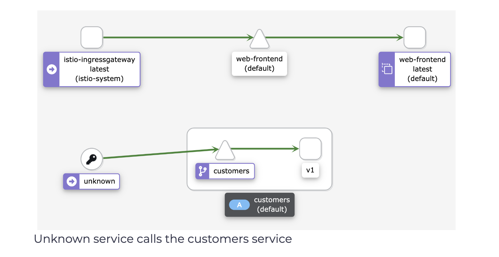
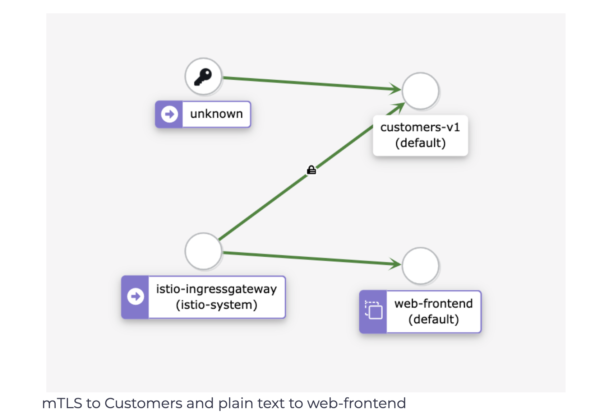

## Enable mTLS
In this lab, we will deploy the sample application (Web Frontend and Customer service). The web frontend will be deployed without an Envoy proxy sidecar, while the Customer service will have the sidecar injected. With this setup, we will see how Istio can send both mTLS and plain text traffic and change the TLS mode to STRICT.

Let’s start by deploying a Gateway resource:

```yaml
apiVersion: networking.istio.io/v1alpha3
kind: Gateway
metadata:
  name: gateway
spec:
  selector:
    istio: ingressgateway
  servers:
    - port:
        number: 80
        name: http
        protocol: HTTP
      hosts:
        - '*'
```

Save the above YAML to gateway.yaml and deploy the Gateway using kubectl apply -f gateway.yaml

Next, we will create the Web Frontend and the Customer service deployments and related Kubernetes services. We will disable the automatic sidecar injection in the default namespace before deploying, so the proxy doesn’t get injected into the Web frontend deployment. Before we deploy the Customer service, we will enable the injection again.

```shell
$ kubectl label namespace default istio-injection-
namespace/default labeled
```

With injection disabled, let’s deploy the web-frontend:

```yaml
apiVersion: apps/v1
kind: Deployment
metadata:
  name: web-frontend
  labels:
    app: web-frontend
spec:
  replicas: 1
  selector:
    matchLabels:
      app: web-frontend
  template:
    metadata:
      labels:
        app: web-frontend
        version: v1
    spec:
      containers:
        - image: gcr.io/tetratelabs/web-frontend:1.0.0
          imagePullPolicy: Always
          name: web
          ports:
            - containerPort: 8080
          env:
            - name: CUSTOMER_SERVICE_URL
              value: 'http://customers.default.svc.cluster.local'
---
kind: Service
apiVersion: v1
metadata:
  name: web-frontend
  labels:
    app: web-frontend
spec:
  selector:
    app: web-frontend
  ports:
    - port: 80
      name: http
      targetPort: 8080
---
apiVersion: networking.istio.io/v1alpha3
kind: VirtualService
metadata:
  name: web-frontend
spec:
  hosts:
    - '*'
  gateways:
    - gateway
  http:
    - route:
        - destination:
            host: web-frontend.default.svc.cluster.local
            port:
              number: 80
```

Save the above YAML to web-frontend.yaml and create the deployment and service using kubectl apply -f web-frontend.yaml. If we look at the running Pods, we should see one Pod with a single container running, indicated by the 1/1 in the READY column:

```shell
$ kubectl get po
NAME                           READY   STATUS    RESTARTS   AGE
web-frontend-659f65f49-cbhvl   1/1     Running   0          7m31s
```

Let’s enable the automatic injection:

```shell
$ kubectl label namespace default istio-injection=enabled
namespace/default labeled
```

And the deploy the v1 of the Customer service:

```yaml
apiVersion: apps/v1
kind: Deployment
metadata:
  name: customers-v1
  labels:
    app: customers
    version: v1
spec:
  replicas: 1
  selector:
    matchLabels:
      app: customers
      version: v1
  template:
    metadata:
      labels:
        app: customers
        version: v1
    spec:
      containers:
        - image: gcr.io/tetratelabs/customers:1.0.0
          imagePullPolicy: Always
          name: svc
          ports:
            - containerPort: 3000
---
kind: Service
apiVersion: v1
metadata:
  name: customers
  labels:
    app: customers
spec:
  selector:
    app: customers
  ports:
    - port: 80
      name: http
      targetPort: 3000
---
apiVersion: networking.istio.io/v1alpha3
kind: VirtualService
metadata:
  name: customers
spec:
  hosts:
    - 'customers.default.svc.cluster.local'
  http:
    - route:
        - destination:
            host: customers.default.svc.cluster.local
            port:
              number: 80
```

Save the above to customers-v1.yaml and create the deployment and service using kubectl apply -f customers-v1.yaml.

We should have both applications deployed and running - the customers’ service will have two containers, and the web frontend service will have one:

```shell
$ kubectl get po
NAME                            READY   STATUS    RESTARTS   AGE
customers-v1-7857944975-qrqsz   2/2     Running   0          4m1s
web-frontend-659f65f49-cbhvl    1/1     Running   0          13m
```

If we try and access the web page from the GATEWAY_URL, we will get the web page with the customer service’s response.

Accessing the GATEWAY_URL works because of the permissive mode, where plain text traffic gets sent to the services that don’t have the proxy. In this case, the ingress gateway sends plain text traffic to the Web frontend because there’s no proxy.

If we open Kiali with getmesh istioctl dash kiali and look at the Graph, you will notice that Kiali detects calls made from the ingress gateway to web-frontend. However, the calls made to the customers service are coming from unknown service. This is because there’s no proxy next to the web frontend. Therefore Istio doesn’t know who, where or what that service is.

 </img>

Let’s update the customers VirtualService and attach the gateway to it. Attaching the gateway allows us to make calls directly to the customers service.

```yaml
apiVersion: networking.istio.io/v1alpha3
kind: VirtualService
metadata:
  name: customers
spec:
  hosts:
    - 'customers.default.svc.cluster.local'
  gateways:
    - gateway
  http:
    - route:
        - destination:
            host: customers.default.svc.cluster.local
            port:
              number: 80
```

Save the above to vs-customers-gateway.yaml and update the VirtualService using kubectl apply -f vs-customers-gateway.yaml.

We can now specify the Host header and we’ll be able to send the requests through the ingress gateway (GATEWAY_URL) to the customers service:

```shell
$ curl -H "Host: customers.default.svc.cluster.local" http://$GATEWAY_URL;
[{"name":"Jewel Schaefer"},{"name":"Raleigh Larson"},{"name":"Eloise Senger"},{"name":"Moshe Zieme"},{"name":"Filiberto Lubowitz"},{"name":"Ms.Kadin Kling"},{"name":"Jennyfer Bergstrom"},{"name":"Candelario Rutherford"},{"name":"Kenyatta Flatley"},{"name":"Gianni Pouros"}]
```

To generate some traffic to both the Web frontend and Customers service through the ingress, open the two terminal windows and run one command in each:

```shell
// Terminal 1 
$ while true; do curl -H "Host: customers.default.svc.cluster.local" http://$GATEWAY_URL; done
...
// Terminal 2
$ while true; do curl http://$GATEWAY_URL; done
```

Open Kiali and look at the Graph. From the Display dropdown, make sure we check the Security option. You should see a graph similar to the one in the following figure.

 </img>

Notice a padlock icon between the ingress gateway and the customers service, which means the traffic gets sent using mTLS.

> If you don’t see the padlock icon, click the Display dropdown and make sure “Security” option is selected.

However, there’s no padlock between the unknown (web frontend) and the customers service, as well as the istio-ingress-gateway and web-frontend. Istio is sending plain text traffic to and from the services without the sidecar injected.

Let’s see what happens if we enable mTLS in STRICT mode. We expect the calls from the frontend to the customer service to start failing because there’s no proxy injected to do the mTLS communication. On the other hand, the calls from the ingress gateway to the customer service will continue working.

```yaml
apiVersion: security.istio.io/v1beta1
kind: PeerAuthentication
metadata:
  name: default
  namespace: default
spec:
  mtls:
    mode: STRICT
```

Save the above YAML to strict-mtls.yaml and create the PeerAuthentication resource using kubectl apply -f strict-mtls.yaml.

If we still have the request loop running, we will see the ECONNRESET error message from the web frontend. This error indicates that the customers side closed the connection. In our case, it was because it was expecting an mTLS connection.

On the other hand, the requests we’re making directly to the customers service continue to work because the customer service has an Envoy proxy running next to it and can do mutual TLS.

If we delete the PeerAuthentication resource deployed earlier (kubectl delete peerauthentication default), Istio returns to its default (PERMISSIVE mode), and the errors will disappear.

### Cleanup
Delete the Deployments, Services, VirtualServices, and the Gateway:

```shell
kubectl delete deploy web-frontend customers-v1
kubectl delete svc customers web-frontend
kubectl delete vs customers web-frontend
kubectl delete gateway gateway
```

## files

### webfrontend-210119-085648.yaml
```yaml
apiVersion: apps/v1
kind: Deployment
metadata:
  name: web-frontend
  labels:
    app: web-frontend
spec:
  replicas: 1
  selector:
    matchLabels:
      app: web-frontend
  template:
    metadata:
      labels:
        app: web-frontend
        version: v1
    spec:
      containers:
        - image: gcr.io/tetratelabs/web-frontend:1.0.0
          imagePullPolicy: Always
          name: web
          ports:
            - containerPort: 8080
          env:
            - name: CUSTOMER_SERVICE_URL
              value: 'http://customers.default.svc.cluster.local'
---
kind: Service
apiVersion: v1
metadata:
  name: web-frontend
  labels:
    app: web-frontend
spec:
  selector:
    app: web-frontend
  ports:
    - port: 80
      name: http
      targetPort: 8080
---
apiVersion: networking.istio.io/v1alpha3
kind: VirtualService
metadata:
  name: web-frontend
spec:
  hosts:
    - '*'
  gateways:
    - gateway
  http:
    - route:
        - destination:
            host: web-frontend.default.svc.cluster.local
            port:
              number: 80
```
### gateway-210119-085648.yaml
```yaml
apiVersion: networking.istio.io/v1alpha3
kind: Gateway
metadata:
  name: gateway
spec:
  selector:
    istio: ingressgateway
  servers:
    - port:
        number: 80
        name: http
        protocol: HTTP
      hosts:
        - '*'
```

### vscustomersgateway-210119-085648.yaml

```yaml
apiVersion: networking.istio.io/v1alpha3
kind: VirtualService
metadata:
  name: customers
spec:
  hosts:
    - 'customers.default.svc.cluster.local'
  gateways:
    - gateway
  http:
    - route:
        - destination:
            host: customers.default.svc.cluster.local
            port:
              number: 80
```
### customersv1-210119-085648.yaml

```yaml
apiVersion: apps/v1
kind: Deployment
metadata:
  name: customers-v1
  labels:
    app: customers
    version: v1
spec:
  replicas: 1
  selector:
    matchLabels:
      app: customers
      version: v1
  template:
    metadata:
      labels:
        app: customers
        version: v1
    spec:
      containers:
        - image: gcr.io/tetratelabs/customers:1.0.0
          imagePullPolicy: Always
          name: svc
          ports:
            - containerPort: 3000
---
kind: Service
apiVersion: v1
metadata:
  name: customers
  labels:
    app: customers
spec:
  selector:
    app: customers
  ports:
    - port: 80
      name: http
      targetPort: 3000
---
apiVersion: networking.istio.io/v1alpha3
kind: VirtualService
metadata:
  name: customers
spec:
  hosts:
    - 'customers.default.svc.cluster.local'
  http:
    - route:
        - destination:
            host: customers.default.svc.cluster.local
            port:
              number: 80
```

### strict-mtls.yaml

```yaml
apiVersion: security.istio.io/v1beta1
kind: PeerAuthentication
metadata:
  name: default
  namespace: default
spec:
  mtls:
    mode: STRICT
```


