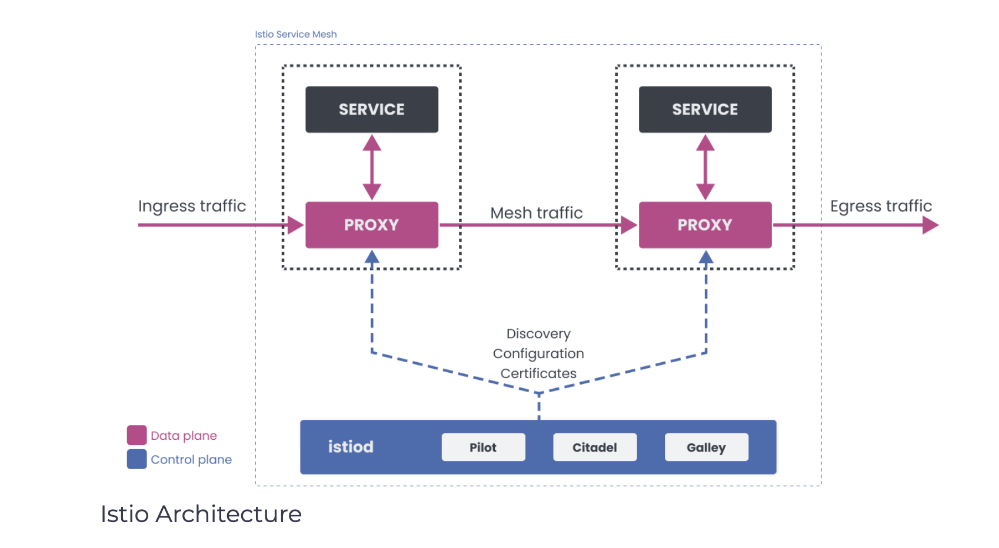

# Introducing Istio
Istio is an open-source implementation of a service mesh. At a high level, Istio supports the following features:

1. Traffic management
Using configuration, we can control the flow of traffic between services. Setting up circuit breakers, timeouts, or retries can be done with a simple configuration change.

2. Observability
Istio gives us a better understanding of your services through tracing, monitoring, and logging, and it allows us to detect and fix issues quickly.

3. Security
Istio can manage authentication, authorization, and encryption of the communication at the proxy level. We can enforce policies across services with a quick configuration change.

## Istio Components
Istio service mesh has two pieces: a **data plane** and a **control plane**.

When building distributed systems, separating the components into a control plane and a data plane is a common pattern. The components in the data plane are on the request path, while the control plane components help the data plane to do its work.

The data plane in Istio consists of **Envoy proxies** that control the communication between services. The **control plane** portion of the mesh is responsible for managing and configuring the proxies.

</img>

## Envoy (data plane)

Envoy is a high-performance proxy developed in C++. Istio service mesh injects the Envoy proxy as a sidecar container next to your application container. The proxy then intercepts all inbound and outbound traffic for that service. Together, the injected proxies form the data plane of a service mesh.

Envoy proxy is also the only component that interacts with the traffic. In addition to the features mentioned earlier - the load balancing, circuit breakers, fault injection, etc. Envoy also supports a pluggable extension model based on WebAssembly (WASM). The extensibility allows us to enforce custom policies and generate telemetry for the traffic in the mesh.

## Istiod (control plane)

Istiod is the control plane component that provides service discovery, configuration, and certificate management features. Istiod takes the high-level rules written in YAML and converts them into an actionable configuration for Envoy. Then, it propagates this configuration to all sidecars in the mesh.

The pilot component inside Istiod abstracts the platform-specific service discovery mechanisms (Kubernetes, Consul, or VMs) and converts them into a standard format that sidecars can consume.

Using the built-in identity and credential management, we can enable strong service-to-service and end-user authentication. With authorization features, we can control who can access your services.

The portion of the control plane, formerly known as Citadel, acts as a certificate authority and generates certificates that allow secure mutual TLS communication between the proxies in the data plane.
