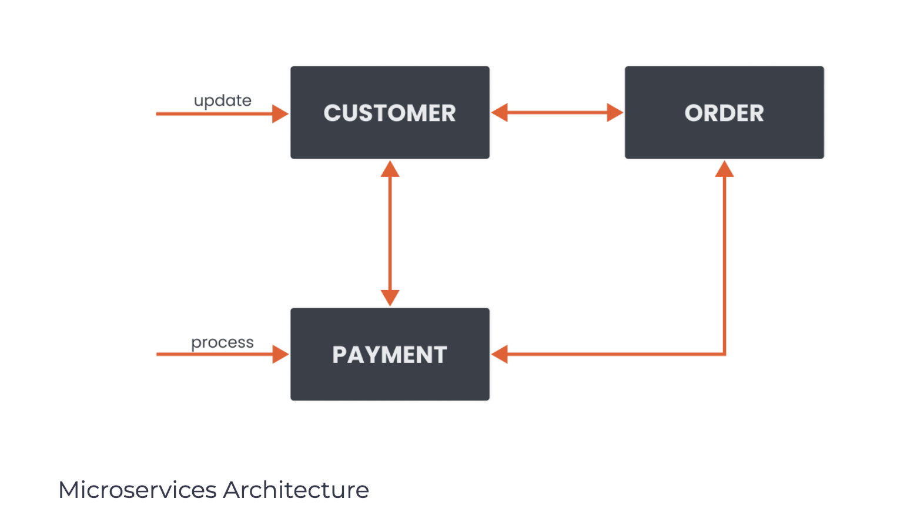

# Introduction
Developers frequently break down cloud-native applications into multiple services that perform specific actions. We might have a service that only deals with the Customers and deals with Orders or Payments. All these services communicate with each other through the network. If a new payment needs to be processed, the request gets sent to the Payment service. If customer data needs to be updated, the request gets sent to the Customer service, and so on.

</img>

This type of architecture is called microservices architecture. There are a couple of benefits to this architecture. We can have multiple smaller teams working on individual services. These teams have the flexibility to pick their tech stack and languages and usually have the autonomy to deploy and release their services independently. The fuel that’s behind making these services work is the network that enables services to communicate. As the number of services grows, so does the communication and network chatter between them. The number of services and teams makes monitoring and managing communication logic reasonably complex.

Since we also know that networks are unreliable and will fail, the combination of all this makes microservices quite complex to manage and monitor.