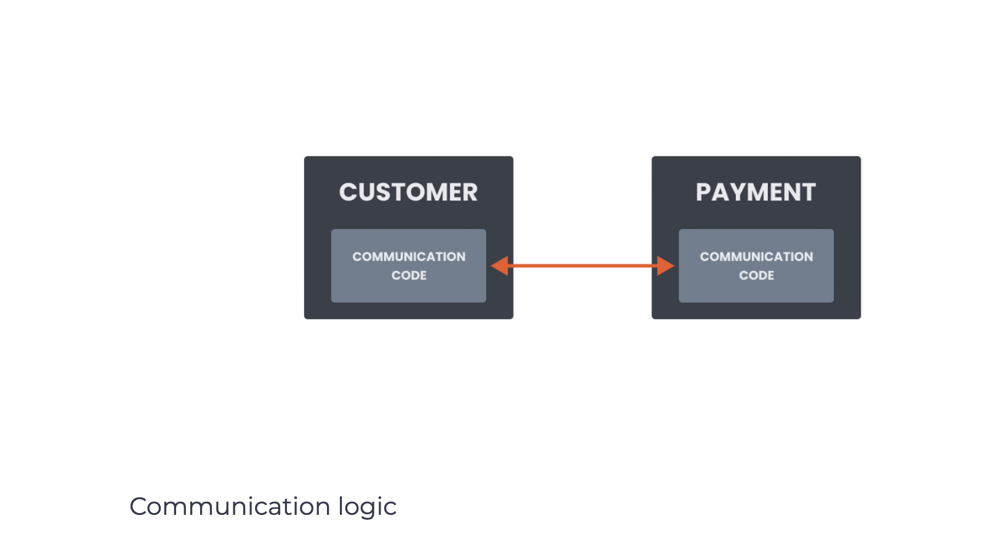
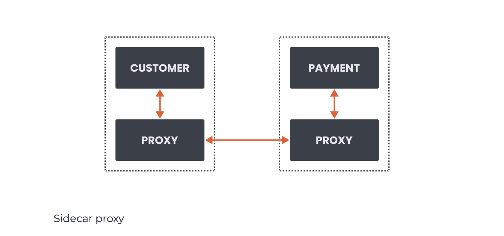

# Service mesh overview
A service mesh is defined as a dedicated infrastructure layer for managing service-to-service communication to make it manageable, visible, and controlled. In some versions of the definition, you might also hear about how a service mesh can make the communication between services safe and reliable. If I had to describe service mesh with a more straightforward sentence, I would say that the service mesh is all about the communication between services.

But how does the service mesh help with communication? Let’s think about the communication logic and where it usually lives. The communication logic is any code that handles the inbound or outbound requests, the retry logic, timeouts, or even perhaps traffic routing. In most cases, developers build this logic as part of the service. So anytime service A calls service B, the request goes through this communication code logic, which decides how to handle the request.

</img>

We mentioned that we might end up with a significant number of services if we go with the microservices approach. How do we deal with the communication logic for all these services? We could create a shared library that contains this logic and reuse it in multiple places. The shared library approach might work fine, assuming we use the same stack or programming language for all of your services. If we don’t, we will have to reimplement the library, and reimplementing something is never a fair use of your time. We might also use services you don’t own the codebase for. In that case, we cannot control the communication logic or monitoring.

The second issue is configuration. In addition to configuring your application, we also have to maintain the communication logic configuration. If we ever need to tweak or update multiple services simultaneously, we will have to do that for each service separately.

Service mesh takes this communication logic, the retries, timeouts, and so on, out of the individual service and moves it into a separate infrastructure layer. The infrastructure layer, in the case of a service mesh, is an array of network proxies. The collection of these network proxies (one next to each service instance) deals with all communication logic between your services. We call these proxies sidecars because they live alongside each service.

</img>

Previously, if we had Customer service talking to the Payment service directly, now we have a proxy next to Customer service talking to a proxy next to Payment service. The collection of these proxies (the infrastructure layer) forms a network mesh, called a service mesh. The service mesh control plane configures the proxies so that they intercept all inbound and outbound requests transparently.

The communication logic separated from the business and application logic allows the developers to focus on the business logic, and service mesh operators focus on the service mesh configuration.

Why do I need a service mesh?
A service mesh gives us a consistent way to connect, secure, and observe microservices. Every failure, successful call, retry, or timeout can be captured, visualized, and alerted. We can do these scenarios because the proxies capture the requests and metrics from all communication within the mesh. Additionally, we can make decisions based on the request properties. For example, we can inspect the inbound (or outbound) request and write rules that route all requests with a specific header value to a different service version.

All this information and collected metrics make several scenarios reasonably straightforward to implement. Developers and operators can configure and execute the following scenarios without any code changes to the services:

* mutual TLS and automatic certificate rotation
* identifying performance and reliability issues using metrics
* visualizing metrics in tools like Grafana; this further allows altering and integrating with PagerDuty, for example
* debugging services and tracing using Jaeger or Zipkin*
* weight-based and request based traffic routing, canary deployments, A/B testing
* traffic mirroring
* increase service resiliency with timeouts and retries
* chaos testing by injecting failures and delays between services
* circuit breakers for detecting and ejecting unhealthy service instances

> *Requires minor code changes to propagate tracing headers between services
