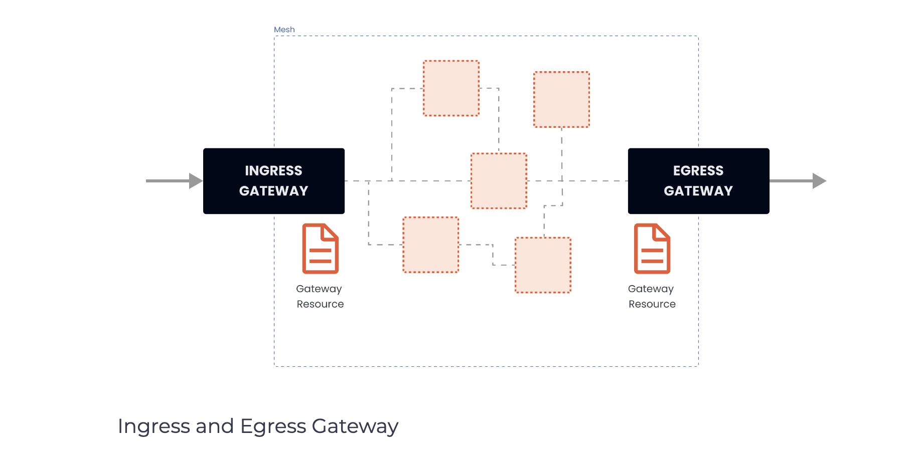
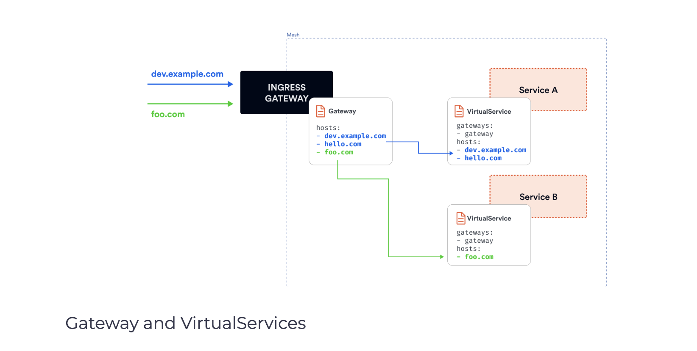

# Exposing services using Gateway resource

As part of the Istio installation, we installed the Istio ingress and egress gateways. Both gateways run an instance of the Envoy proxy, and they operate as load balancers at the edge of the mesh. The ingress gateway receives inbound connections, while the egress gateway receives connections going out of the cluster.

Using the ingress gateway, we can apply route rules to the traffic entering the cluster. We can have a single external IP address that points to the ingress gateway and route traffic to different services within the cluster based on the host header.

</img>

We can configure both gateways using a Gateway resource. The Gateway resource describes the exposed ports, protocols, SNI (Server Name Indication) configuration for the load balancer, etc.

Under the covers, the Gateway resource controls how the Envoy proxy listens on the network interface and which certificates it presents.

Here’s an example of a Gateway resource:

```yaml
apiVersion: networking.istio.io/v1alpha3
kind: Gateway
metadata:
  name: my-gateway
  namespace: default
spec:
  selector:
    istio: ingressgateway
  servers:
  - port:
      number: 80
      name: http
      protocol: HTTP
    hosts:
    - dev.example.com
    - test.example.com
```

The above Gateway resources set up the Envoy proxy as a load balancer exposing port 80 for ingress. The gateway configuration gets applied to the Istio ingress gateway proxy, which we deployed to the istio-system namespace and has the label istio: ingressgateway set. With a Gateway resource, we can only configure the load balancer. The hosts field acts as a filter and will let through only traffic destined for dev.example.com and test.example.com.

To control and forward the traffic to an actual Kubernetes service running inside the cluster, we have to configure a VirtualService with specific hostnames (dev.example.com and test.example.com for example) and then attach the Gateway to it.

</img>

## Gateway and VirtualServices
The Ingress gateway we deployed as part of the demo Istio installation created a Kubernetes service with the LoadBalancer type that gets an external IP assigned to it, for example:

```shell
$ kubectl get svc -n istio-system
NAME                   TYPE           CLUSTER-IP     EXTERNAL-IP      PORT(S)                                                                      AGE
istio-egressgateway    ClusterIP      10.0.146.214   <none>           80/TCP,443/TCP,15443/TCP                                                     7m56s
istio-ingressgateway   LoadBalancer   10.0.98.7      XX.XXX.XXX.XXX   15021:31395/TCP,80:32542/TCP,443:31347/TCP,31400:32663/TCP,15443:31525/TCP   7m56s
istiod                 ClusterIP      10.0.66.251    <none>           15010/TCP,15012/TCP,443/TCP,15014/TCP,853/TCP                                8m6s
```

> The way the LoadBalancer Kubernetes service type works depends on how and where we’re running the Kubernetes cluster. For a cloud-managed cluster (GCP, AWS, Azure, etc.), a load balancer resource gets provisioned in your cloud account, and the Kubernetes LoadBalancer service will get an external IP address assigned to it. Suppose we’re using Minikube or Docker Desktop. In that case, the external IP address will either be set to localhost (Docker Desktop) or, if we’re using Minikube, it will remain pending, and we will have to use the minikube tunnel command to get an IP address.

In addition to the ingress gateway, we can also deploy an egress gateway to control and filter traffic that’s leaving our mesh.

We can use the same Gateway resource to configure the egress gateway like we configured the ingress gateway. Using the egress gateway allows us to centralize all outgoing traffic, logging, and authorization.

