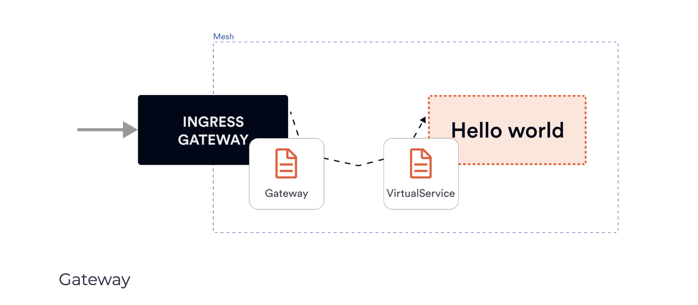

# Creating a deployment and using a Gateway to expose it
In this lab, we will deploy a Hello World application to the cluster. We will then deploy a Gateway resource and a VirtualService that binds to the Gateway to expose the application on the external IP address.

</img>


Let’s start by deploying the Gateway resource first. We will set the hosts field to * to access the ingress gateway directly from the external IP address. If we wanted to access the ingress gateway through a domain name, we could set the hosts’ value to a domain name (e.g. example.com) and add the external IP address to an A record for the domain.

```yaml
apiVersion: networking.istio.io/v1alpha3
kind: Gateway
metadata:
  name: gateway
spec:
  selector:
    istio: ingressgateway
  servers:
    - port:
        number: 80
        name: http
        protocol: HTTP
      hosts:
        - '*'
```

Save the above YAML to gateway.yaml and deploy the Gateway using kubectl apply -f gateway.yaml

If we try to access the ingress gateways’ external IP address, we will get back an HTTP 404 because there aren’t any VirtualServices bound to the Gateway. The ingress proxy doesn’t know where to route the traffic as we haven’t defined any routes yet.

To get the ingress gateways external IP address, run the command below and look at the EXTERNAL-IP column value:

```shell
$ kubectl get svc -l=istio=ingressgateway -n istio-system
NAME                   TYPE           CLUSTER-IP   EXTERNAL-IP      PORT(S)                                                                      AGE
istio-ingressgateway   LoadBalancer   10.0.98.7    50.130.100.200   15021:31395/TCP,80:32542/TCP,443:31347/TCP,31400:32663/TCP,15443:31525/TCP   9h
```

Throughout the rest of the course, we’ll be using GATEWAY_URL in examples and text when talking about the ingress gateway’s external IP.

The next step is to create the Hello World deployment and service. The Hello world application is a simple website that just renders “Hello world”.

```yaml
apiVersion: apps/v1
kind: Deployment
metadata:
  name: hello-world
  labels:
    app: hello-world
spec:
  replicas: 1
  selector:
    matchLabels:
      app: hello-world
  template:
    metadata:
      labels:
        app: hello-world
    spec:
      containers:
        - image: gcr.io/tetratelabs/hello-world:1.0.0
          imagePullPolicy: Always
          name: svc
          ports:
            - containerPort: 3000
---
kind: Service
apiVersion: v1
metadata:
  name: hello-world
  labels:
    app: hello-world
spec:
  selector:
    app: hello-world
  ports:
    - port: 80
      name: http
      targetPort: 3000
```

Save the above YAML to hello-world.yaml and create the deployment and service using kubectl apply -f hello-world.yaml.

If we look at the created Pods, we will notice two containers running. One is the Envoy sidecar proxy, and the second one is the application. We have also created a Kubernetes service called hello-world:

```shell
$ kubectl get po,svc -l=app=hello-world
NAME                               READY   STATUS    RESTARTS   AGE
pod/hello-world-6bf9d9bdb6-r8bb4   2/2     Running   0          78s

NAME                  TYPE        CLUSTER-IP     EXTERNAL-IP   PORT(S)   AGE
service/hello-world   ClusterIP   10.0.155.147   <none>        80/TCP    78s
```

The next step is to create a VirtualService for the hello-world service and bind it to the Gateway resource:

```yaml
apiVersion: networking.istio.io/v1alpha3
kind: VirtualService
metadata:
  name: hello-world
spec:
  hosts:
    - "*"
  gateways:
    - gateway
  http:
    - route:
        - destination:
            host: hello-world.default.svc.cluster.local
            port:
              number: 80
```

We use the * in the hosts field, just like we did in the Gateway. We have also added the Gateway resource we created earlier (gateway) to the gateways array. Finally, we specify a single route with a destination that points to the Kubernetes service hello-world.default.svc.cluster.local.

Save the above YAML to vs-hello-world.yaml and create the VirtualService using kubectl apply -f vs-hello-world.yaml. If you look at the deployed VirtualService, you should see a similar output:

```shell
$ kubectl get vs
NAME          GATEWAYS    HOSTS   AGE
hello-world   [gateway]   [*]     3m31s
```

If we run cURL against GATEWAY_URL or open it in the browser, we will get back a response of Hello World:

```shell
$ curl -v http://$GATEWAY_URL/
*   Trying $GATEWAY_URL...
* TCP_NODELAY set
* Connected to $GATEWAY_URL ($GATEWAY_URL) port 80 (#0)
> GET / HTTP/1.1
> Host: $GATEWAY_URL
> User-Agent: curl/7.64.1
> Accept: */*
>
< HTTP/1.1 200 OK
< date: Mon, 28 Sep 2020 02:59:37 GMT
< content-length: 11
< content-type: text/plain; charset=utf-8
< x-envoy-upstream-service-time: 1
< server: istio-envoy
<
* Connection #0 to host GATEWAY_URL left intact
Hello World* Closing connection 0
```

Also, notice the server header set to istio-envoy telling us that the request went through the Envoy proxy.

## Cleanup
Delete the Deployment, Service, VirtualService, and the Gateway:

```shell
kubectl delete deploy hello-world
kubectl delete service hello-world
kubectl delete vs hello-world
kubectl delete gateway gateway
```

## Files

### gateway.yaml

```yaml
apiVersion: networking.istio.io/v1alpha3
kind: Gateway
metadata:
  name: gateway
spec:
  selector:
    istio: ingressgateway
  servers:
    - port:
        number: 80
        name: http
        protocol: HTTP
      hosts:
        - '*'
```

### hello-world.yaml
```yaml
apiVersion: apps/v1
kind: Deployment
metadata:
  name: hello-world
  labels:
    app: hello-world
spec:
  replicas: 1
  selector:
    matchLabels:
      app: hello-world
  template:
    metadata:
      labels:
        app: hello-world
    spec:
      containers:
        - image: gcr.io/tetratelabs/hello-world:1.0.0
          imagePullPolicy: Always
          name: svc
          ports:
            - containerPort: 3000
---
kind: Service
apiVersion: v1
metadata:
  name: hello-world
  labels:
    app: hello-world
spec:
  selector:
    app: hello-world
  ports:
    - port: 80
      name: http
      targetPort: 3000
```

### vs-hello-world.yaml

```yaml
apiVersion: networking.istio.io/v1alpha3
kind: VirtualService
metadata:
  name: hello-world
spec:
  hosts:
    - "*"
  gateways:
    - gateway
  http:
    - route:
        - destination:
            host: hello-world.default.svc.cluster.local
            port:
              number: 80
```


