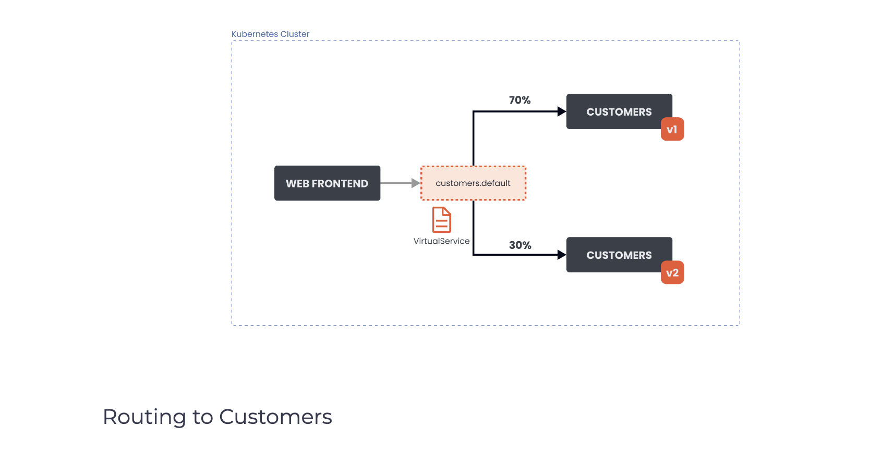

# Simple Routing
We can use the VirtualService resource for traffic routing within the Istio service mesh. With a VirtualService we can define traffic routing rules and apply them when the client tries to connect to the service. An example of this would be sending a request to dev.example.com that eventually ends up at the target service.

Let’s look at an example of running two versions (v1 and v2) of the customers application in the cluster. We have two Kubernetes deployments, customers-v1 and customers-v2. The Pods belonging to these deployments either have a label version: v1 or a label version: v2 set.

</img>

We want to configure the VirtualService to route the traffic to the v1 version of the application. The routing to v1 should happen for 70% of the incoming traffic. The 30% of requests should be sent to the v2 version of the application.

Here’s how the VirtualService resource would look like for the above scenario:

```yaml
apiVersion: networking.istio.io/v1alpha3
kind: VirtualService
metadata:
  name: customers-route
spec:
  hosts:
  - customers.default.svc.cluster.local
  http:
  - name: customers-v1-routes
    route:
    - destination:
        host: customers.default.svc.cluster.local
        subset: v1
      weight: 70
  - name: customers-v2-routes
    route:
    - destination:
        host: customers.default.svc.cluster.local
        subset: v2
      weight: 30
```

Under the hosts field, we define the destination host to which the traffic is being sent. In our case, that’s the customers.default.svc.cluster.local Kubernetes service.

The following field is http, and this field contains an ordered list of route rules for HTTP traffic. The destination refers to a service in the service registry and the destination to which the request will be sent after processing the routing rule. The Istio’s service registry contains all Kubernetes services and any services declared with the ServiceEntry resource.

We are also setting the weight on each of the destinations. The weight equals the proportion of the traffic sent to each of the subsets. The sum of all weight should be 100. If we have a single destination, the weight is assumed to be 100.

With the gateways field, we can also specify the gateway names to which we want to bind this VirtualService. For example:

```yaml
apiVersion: networking.istio.io/v1alpha3
kind: VirtualService
metadata:
  name: customers-route
spec:
  hosts:
    - customers.default.svc.cluster.local
  gateways:
    - my-gateway
  http:
    ...
```

The above YAML binds the customers-route VirtualService to the gateway named my-gateway. Adding the gateway name to the gateways list in the VirtualService exposes the destination routes through the gateway.

When a VirtualService is attached to a Gateway, only the hosts defined in the Gateway resource will be allowed. The following table explains how the hosts field in a Gateway resource acts as a filter and the hosts field in the VirtualService as a match.

